# Easy CMS - Architecture Development Plan

This plan is the technical architecture document for Easy CMS. Confirmed key deviations from the originating spec (no longer in-tree):

- **FastAPI** replaces Flask for both server-side components.
- The system is **three-tier**: a hosted **Sync Server**, a per-user **CMS Studio**, and a generated public **Site**.
- Public sites are deployed to **GitHub Pages** at a fixed URL pattern: `https://elc.github.io/easy-cms/<site-slug>/`. The Sync Server pushes to one shared GitHub repo using a fine-scoped PAT; a GitHub Action builds every site independently and deploys to GitHub Pages.
- All sites are **public by default**. Private hosting is out of scope (future paid feature).
- The generated site uses a **service worker** that caches the entire site (every article, asset, and the offline fallback) so a visitor with intermittent connectivity can read the whole site offline indefinitely.
- **Authentication uses Google OAuth**. The Sync Server never stores passwords. After Google verifies the user, the Sync Server issues an HMAC-signed long-lived JWT, cached by the Studio; subsequent logins bypass Google as long as the JWT is valid. The same JWT is bearer auth for every Sync Server API call.
- The CMS Studio frontend is a **React SPA** with a custom design system, served by a **local FastAPI sidecar** on `127.0.0.1`. Offline-first authoring is preserved through a SQLite-backed Article store and an offline change queue.
- The site is generated with **Astro + TypeScript** from a fixed template. End users do not modify it.
- Source code lives in **one monorepo**; the Sync Server has no Git internals - the runtime per-Site state is the change log in Supabase Postgres.
- **Sync Server deploys to Vercel** (serverless functions). Persistent state (users, sites, articles, change log, assets, settings) lives in **Supabase** (managed Postgres + Storage). The Studio uses local **SQLite** for cached JWT, articles, the offline change queue, and assets.
- **Type safety and determinism are first-class engineering concerns** across the Sync Server (Python + Pydantic), the Studio sidecar (Python + Pydantic), and every frontend (React SPA + Astro template, both TypeScript with `strict` enabled). The codebase communicates intent through types - discriminated unions over magic strings, custom exceptions over generic errors, non-nullable fields wherever possible, runtime validation only at I/O boundaries, and deterministic behaviour over runtime polymorphism. See section 11.

**Important consequence**: Vercel's filesystem is ephemeral and per-invocation, so the Sync Server cannot host bare Git repositories the way the earlier draft assumed. The architecture below replaces the would-be per-site bare Git repos with a JSON-based change-log protocol persisted in Supabase. See ADR 0001.

**Canonical glossary**: terminology in this plan follows [CONTEXT.md](CONTEXT.md). Domain decisions hard to reverse are recorded in [docs/adr/](docs/adr/):

- [0001 - JSON change-log protocol](docs/adr/0001-json-change-log-protocol.md)
- [0002 - Google OAuth + HMAC JWT, no passwords](docs/adr/0002-google-oauth-hmac-jwt-no-passwords.md)
- [0003 - Service worker precaches the entire Site](docs/adr/0003-service-worker-precaches-entire-site.md)
- [0004 - Public-by-default on GitHub Pages](docs/adr/0004-public-by-default-github-pages.md)
- [0005 - Per-Article publication, no global "main"](docs/adr/0005-per-article-publication.md)

The output will be written to [docs/development-plan.md](docs/development-plan.md) once approved.

---

## 1. System overview

Three runtime components plus an external GitHub-based publishing pipeline:

- **Sync Server** (hosted on Vercel, multi-tenant) - FastAPI serverless functions for the API + admin panel SPA. Backed by Supabase (Postgres for relational state, Storage for binary article assets). Google OAuth, JWT issuance, change-log ingestion, and a publisher that pushes content to GitHub on publish.
- **CMS Studio** (per user, portable) - FastAPI sidecar bound to `127.0.0.1` + React SPA + local **SQLite** + a local Git working tree of one site (used purely for offline authoring history; never pushed to a remote Git endpoint). Packaged as a portable executable that auto-opens a browser window.
- **Publishing pipeline (external)** - one shared GitHub repo + a GitHub Action that builds every site with Astro and deploys to GitHub Pages.
- **Generated Site** (per site) - static output on GitHub Pages with a service worker that fully precaches every site asset for offline reading.

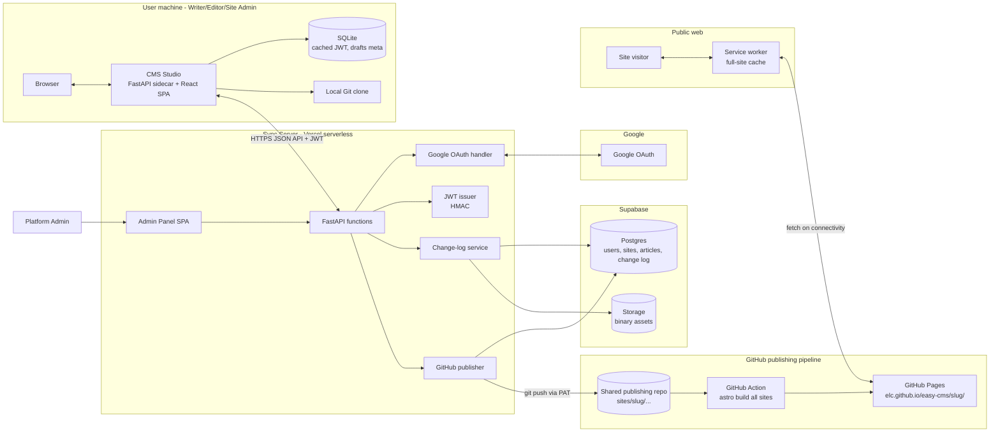

---

## 2. Code monorepo layout

A single repo holds everything that is built and shipped. Per-site Git repos are runtime artifacts and live only inside the Sync Server.

- `apps/studio` - CMS Studio. FastAPI sidecar (Python) + React SPA (Vite + TypeScript). Packaged as a single executable.
- `apps/sync-server` - FastAPI API, admin panel React SPA, embedded Git hosting, GitHub publisher, OAuth handler.
- `apps/site-template` - Astro + TypeScript template (including the service worker) used by the GitHub Action to render every site.
- `apps/publishing-repo-template` - the seed structure of the shared publishing repo (folder layout, GitHub Action workflow).
- `packages/design-system` - shared React component library + tokens, consumed by both `studio` and the sync server admin panel.
- `packages/shared-types` - TypeScript types and OpenAPI-derived clients shared across all frontends.
- `packages/python-shared` - shared Python domain models / DTOs between Studio and Sync Server.
- `infra/` - Dockerfiles and deploy manifests for the Sync Server.

---

## 3. Authentication

The system never stores user passwords. Identity is delegated to Google; Sync Server issues a long-lived HMAC-signed JWT after a successful OAuth roundtrip. The JWT is the only credential the Studio uses against the Sync Server.

- **OAuth provider**: Google. Scopes: `openid email profile`.
- **JWT**: HMAC-SHA256, secret stored on the Sync Server only (Vercel environment variable). Claims include `sub` (Sync Server user id), `email`, `site_id`, `role`, `token_version`, `iat`, `exp`. Lifetime: 30 days.
- **Refresh**: Studio attempts a silent refresh whenever connectivity is available and the JWT is older than half its lifetime. If refresh fails because the user record is disabled or revoked, the Studio surfaces a re-login prompt.
- **Bypass after first login**: as long as the cached JWT is valid, no Google round-trip is needed. The Studio works fully offline using the cached JWT.
- **Wire protocol**: HTTPS + JSON. All Studio-to-Sync-Server traffic uses `Authorization: Bearer <jwt>`; there is no Git smart-HTTP endpoint.
- **Provisioning**: Platform Admin creates a site by entering the future Site Admin's Google email; a pending user record is created in Supabase. On first OAuth login the email is matched and the account is activated. Editors and Writers are likewise added by email and activated on first OAuth login.
- **Revocation**: deleting a user or rotating the JWT secret invalidates outstanding tokens. Per-token revocation is achieved by storing a `token_version` on the user row; the JWT carries the version and is rejected if it does not match.

---

## 4. Sync Server architecture

The Sync Server is the authority for identity, tenants, and the canonical change log. It runs as a set of FastAPI serverless functions on Vercel; all persistent state lives in Supabase. It does not build or host the public site.

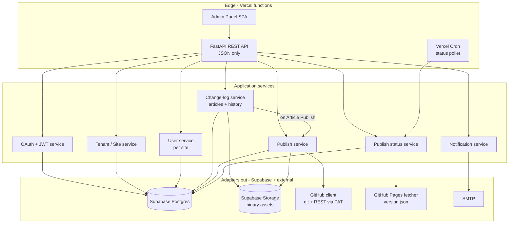

Key responsibilities:

- **TenantSvc** - creates a site (DB row + seed change log + initial site config) and assigns one Site Admin by Google email.
- **AuthSvc** - performs the Google OAuth dance, looks up or activates the user by email, issues HMAC JWTs, validates them on every request.
- **UserSvcS** - per-site user/role storage scoped by `site_id`. No password column.
- **ChangeLogSvc** - the heart of the wire protocol. Accepts ordered batches of changes from a Studio (see section 5), persists them to Supabase Postgres as immutable Revision rows, advances each Article's `latest_draft_revision` pointer, and returns conflicts when a Studio's base does not match the server's. Tracks Article state transitions (In progress, Ready for review, Published, Unpublished, Deleted). Binary Assets live in Supabase Storage and are referenced from the Site-wide Asset library.
- **PublishSvc** - on every Article Publish, exports the current Site state (every Article whose `published_revision` is set, the Asset library, the `precache-manifest.json`, and `version.json`) to the shared publishing repo at `sites/<site-slug>/` and pushes via the fine-scoped PAT. Records the published GitHub commit hash per Site in Postgres.
- **StatusSvc** - on a Vercel Cron schedule (e.g. every minute) and on demand, fetches `https://elc.github.io/easy-cms/<slug>/version.json` for sites with pending publishes. Updates `public_commit` on the site row and exposes status per site to the Studio.

---

## 5. Offline operation queue and conflict resolution

This section addresses the explicit open question: how does the Studio queue work done offline and resolve conflicts when reconnecting.

### 5.1 Data model in the Studio (SQLite)

- `articles` - one row per Article (`article_id`, `slug`, `former_slugs`, `review_status: in_progress | ready_for_review`, `is_deleted`, `latest_known_revision_id`, `published_revision_id`).
- `revisions` - immutable snapshots of an Article's content (`revision_id`, `article_id`, `parent_revision_id`, `body_markdown`, `front_matter`, `created_at`, `created_by`).
- `pending_changes` - ordered queue of local mutations not yet acknowledged by the Sync Server. Each row: `id` (monotonic), `article_id`, `op` (create | update | rename | mark_ready | unmark_ready | unpublish | delete | restore), `payload`, `base_revision_id` (server-known tip when the op was created), `created_at`. Op-level UUIDs make replays idempotent.
- `assets` - local cache of Site-wide Asset library entries (`asset_id`, `bytes` or local-cache path, `content_hash`, `uploaded`).

The Studio is the source of truth for in-progress local work; the Sync Server is the source of truth for everything else. Local Git is not used as a sync transport; an optional read-only history view can be reconstructed from the `revisions` table for the user.

### 5.2 Wire protocol (JSON)

- `POST /sites/{id}/changes/sync`
  - request: `{ base_change_id, ops: [pending_changes...] }`
  - response one of:
    - `{ status: "ok", new_change_ids: [...], new_base_change_id }`
    - `{ status: "conflict", conflicts: [{ article_id, server_version, server_change_id, local_op }], new_base_change_id }`
- `GET /sites/{id}/changes?since={change_id}` - pull updates from other users.
- Asset uploads: `POST /sites/{id}/assets` with the binary, returns a stable URI. Uploaded eagerly when online; the queue only holds the URI reference.

The protocol is idempotent: an `op` carries a client-generated UUID, and replaying it after a network glitch is a no-op on the server.

### 5.3 Sync algorithm

```mermaid
sequenceDiagram
    participant Studio
    participant API as Sync Server
    participant DB as Supabase Postgres

    Studio->>Studio: Read pending_changes ordered by id
    Studio->>API: GET /changes since=base_change_id
    API->>DB: read change log
    DB-->>API: remote changes
    API-->>Studio: remote changes (may be empty)

    alt no remote changes
        Studio->>API: POST /changes/sync (base + ops)
        API->>DB: append rows in tx
        API-->>Studio: ok + new_base_change_id
        Studio->>Studio: drop pending_changes, advance base
    else remote changes exist
        Studio->>Studio: rebase local pending_changes on top of remote
        Note over Studio: Conflict-free per-article changes auto-merge
        alt all clean
            Studio->>API: POST /changes/sync (new_base + ops)
            API-->>Studio: ok
        else conflicts present
            Studio->>Studio: surface conflict UI for affected articles
            Note over Studio: User resolves; resolution becomes a new pending_change
            Studio->>API: POST /changes/sync (resolved ops)
            API-->>Studio: ok
        end
    end
```

### 5.4 Conflict-resolution UX in the Studio

- Conflicts are detected per Article. The Studio shows a side-by-side three-pane view of Revisions: `base`, `mine`, `theirs`. The user picks per chunk or pastes a final Revision.
- The resolution is recorded as a new `pending_changes` row with `base_revision_id` set to the server's latest known Revision id for that Article. The resolution is itself an idempotent op that will succeed on the next sync.
- If the user is still offline after resolving, the resolved op waits in the queue.
- Special cases: a delete-vs-edit conflict surfaces as a binary choice; a slug-rename-vs-edit conflict reapplies the edit on the renamed Article and adds the old slug to `former_slugs`.

### 5.5 Why not Git smart-HTTP from the Studio

The earlier draft of this plan had the Studio talking Git smart-HTTP to a Git endpoint on the Sync Server. Vercel's serverless model rules out hosting bare repos on the Sync Server. Two alternatives were considered:

- Push directly from the Studio to a private GitHub repo per site, with the Sync Server brokering tokens. Rejected because it leaks GitHub coupling into every Studio install and complicates revocation.
- Self-host Git on a small persistent VPS alongside the Vercel app. Rejected because it splits the deployment model and undermines the Vercel + Supabase choice.

The JSON change-log protocol described above keeps deployment fully serverless, gives the Studio precise control over conflict UX, and still lets the Sync Server export to a real Git repo (the GitHub publishing repo) when it is time to deploy.

### 5.6 Initial sync

The first time a Site User signs in to a Site (or after a wipe/reinstall), the Studio performs an Initial sync that hydrates the local SQLite tables with every Article and every Asset for the Site.

- **Strategy**: eager. The Studio downloads every Article's latest Revision and every Asset; the goal is that the user is fully offline-capable the moment they finish the bootstrap and stays that way through their next connectivity window.
- **Order**: reverse-chronological (newest content first). Most recent work is what the user is most likely to need; if the user disconnects mid-bootstrap, what is already on disk is the most useful subset.
- **Resumable**: each downloaded Article and Asset is committed to SQLite immediately. The Studio remembers the last `revision_id` and `asset_id` it confirmed; on resume it picks up from there. Network interruption does not lose work.
- **Non-blocking**: Initial sync runs in the background. The user can immediately start creating new Articles; new Articles enter the local SQLite and the offline queue exactly as they would after the bootstrap is complete.
- **Progress UI**: an optional progress bar with ETA shows current item, total items, and bytes remaining. A persistent "sync ready" indicator in the Studio's chrome flips on once the Initial sync completes.

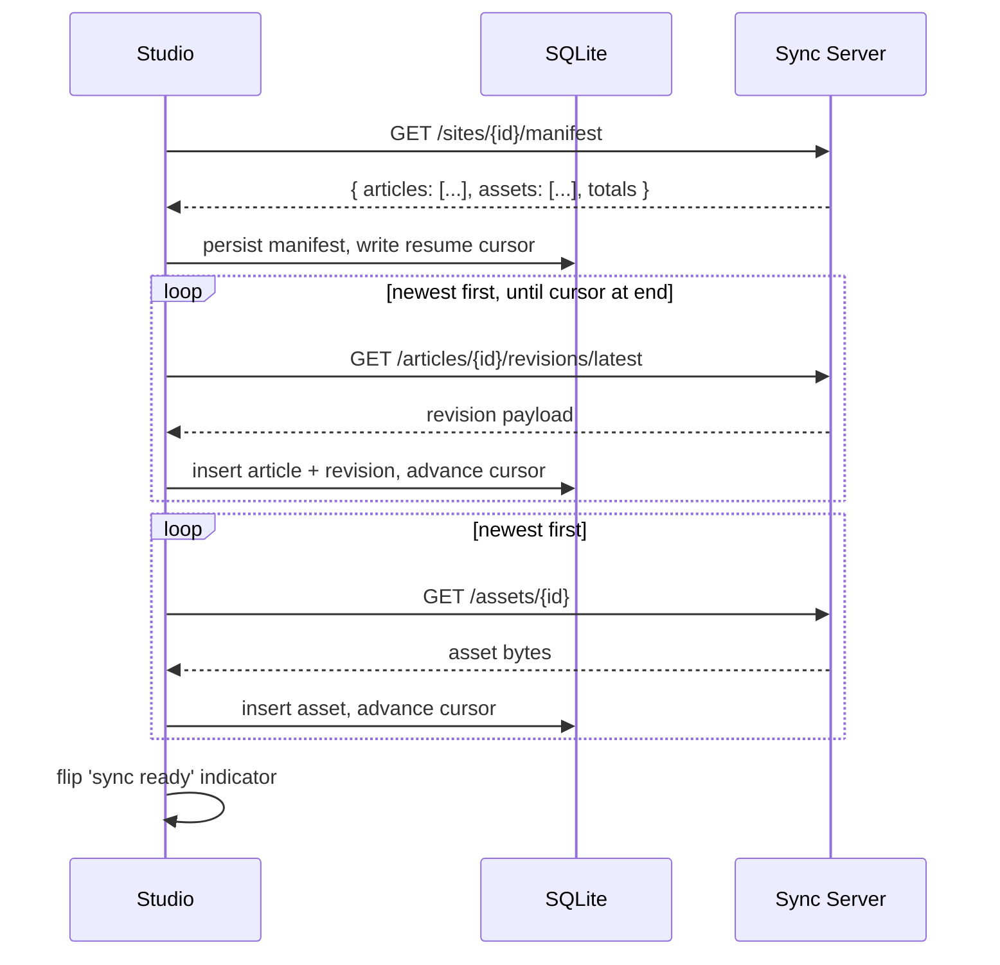

---

## 6. Publishing pipeline (GitHub Pages)

A single shared GitHub repo holds the publishable source for every site, organized by slug. A GitHub Action rebuilds and redeploys on every push.

- **Repo layout**:
  - `sites/<slug>/content/` - Markdown articles and assets, exported by the Sync Server from the per-site bare repo.
  - `sites/<slug>/site.config.json` - per-site config (title, theme overrides, base path).
  - `template/` - the Astro site template imported as a workspace package by every per-site build.
  - `.github/workflows/build-and-deploy.yml` - the GitHub Action.
- **Workflow**:
  1. Trigger: `push` on `main` with path filter `sites/**`.
  2. Detect every site under `sites/*` (no diff filtering: every site is rebuilt independently to keep the action simple and deterministic).
  3. For each site, run `astro build` with `--base /easy-cms/<slug>/` and write into `dist/<slug>/`.
  4. Generate `dist/<slug>/version.json` containing the source commit hash for that site.
  5. Upload the combined `dist/` as the GitHub Pages artifact and deploy.
- **Output URL**: `https://elc.github.io/easy-cms/<slug>/`.
- **Visibility**: public by default; private hosting is out of scope. The `PublishSvc` boundary is the seam where a future paid private-hosting tier can target an alternative sink.

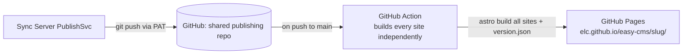

---

## 7. Generated site - offline reading

The site visitor experience is read-only and account-less. The service worker is the linchpin of offline support.

- **Caching strategy**: precache the entire site shell, every article, and every asset on first visit. The site is small enough (article-shaped content) that a full precache is acceptable, and the use case explicitly assumes scarce connectivity (a user may connect once a week and must keep reading until the next sync).
- **Manifest**: the GitHub Action emits a `precache-manifest.json` listing every URL produced by the build, plus a hash. The service worker reads this on install/update and downloads the full set.
- **Update detection**: the service worker checks `/easy-cms/<slug>/version.json` whenever connectivity is available. If the hash differs from what was cached, it triggers a background full re-precache. The previous cache is kept until the new one is fully populated, so users never lose offline access mid-update.
- **Runtime strategy**: cache-first for everything. The service worker falls back to the cached version on any network failure, including DNS errors (so a Sync Server outage or GitHub Pages outage is invisible to the visitor).
- **No login**: the public site has no authentication or personalization. All readers see the same content.
- **Former-slug redirects**: every Former slug is emitted as a small HTML stub at the old URL, with a `<meta http-equiv="refresh">` to the current Slug and a `<link rel="canonical">` to the same. These stubs are part of the precache manifest so even old bookmarks resolve offline.
- **Site slug is immutable**: the Site's `<site-slug>` is part of every URL; it is fixed at Site creation time and cannot be renamed. Article Slugs can change freely (Former slug behaviour).

---

## 8. CMS Studio architecture

The Studio is a portable single-tenant client of one site.

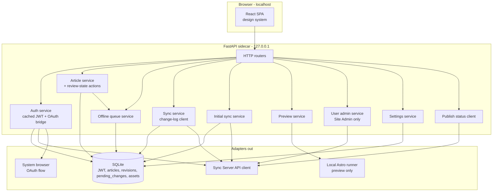

Key responsibilities:

- **AuthSvcL** - JWT cache. On first login (or when the JWT is missing/invalid) opens the system browser to the Sync Server OAuth start URL and listens on a loopback callback, then exchanges the code for a JWT. Stores the JWT in SQLite.
- **ArticleSvc** - CRUD on Articles in SQLite, plus the review-state actions (`mark_ready`, `unmark_ready`) for Writers and the Editor-only actions (`publish`, `send_back`, `unpublish`). Every mutation produces a Revision and enqueues a `pending_changes` row via `QueueSvc`.
- **QueueSvc** - manages the offline queue (append, list, drop on ack, idempotency-key generation). The queue order is the user's intent order; conflicting orders from other Studios are reconciled at sync.
- **SyncSvc** - implements the change-log protocol against the Sync Server: pulls remote Revisions, rebases the local pending queue, posts the queue, surfaces per-Article conflicts to the SPA.
- **InitialSyncSvc** - drives the Initial sync (section 5.6): manifest fetch, reverse-chronological download, resume, progress reporting.
- **PreviewSvc** - runs Astro locally against the SQLite-backed Articles to render a live preview pane.
- **UserSvcL** - thin proxy over Sync Server user endpoints; only Site Admins can call it.
- **StatusClient** - polls Sync Server for publish status (live/pending/failed) and surfaces it as a badge in the UI.

---

## 9. Roles

All roles inherit the privileges of those below them. A single user wearing multiple hats is the expected model on small Sites.

- **Platform Admin** - operates the Sync Server. Uses the Admin Panel SPA. Creates Sites, provisions Site Admins by Google email. Does not touch Site content.
- **Site Admin** - top-level role per Site. Manages Site Users and Site settings. Has Editor and Writer privileges. Site Admin is also the only role that can Hard delete Articles.
- **Editor** - reviews Articles in `Ready for review` state and either Publishes them (advances `published_revision`, triggers `PublishSvc`), Sends them back (returns to `In progress` with an optional comment), or Unpublishes a previously Published Article. Has Writer privileges. An Editor cannot edit a `Ready for review` Article without first Sending it back.
- **Writer** - creates, edits, renames, and Soft-deletes Articles. Marks an Article as `Ready for review` when done; can undo the marking until the Editor acts on it.
- **Site Visitor** - public, anonymous, read-only access via GitHub Pages. No account; offline reading via the service worker.
- **Subscriber** - email address registered through the Generated Site's Subscribe form. Receives a notification on each Publish for that Site. Distinct from a Site User; never logs in.

---

## 10. User flows (sequence diagrams)

### 10.1 Platform Admin creates a site and pre-registers a Site Admin

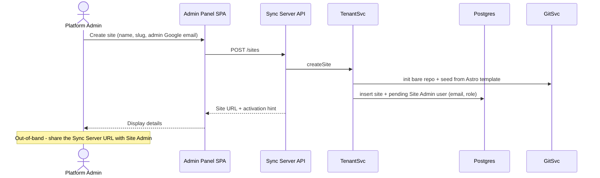

### 10.2 Site Admin first login via Google OAuth

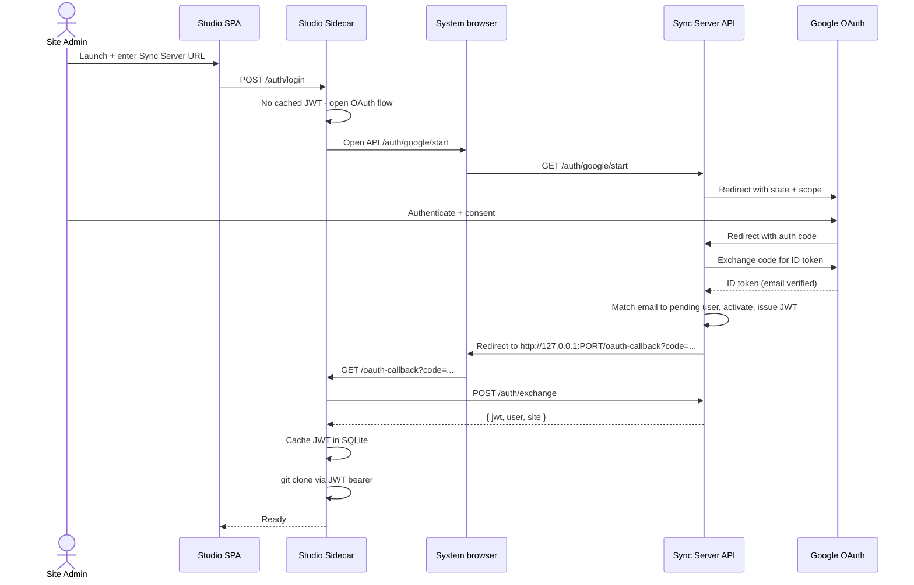

### 10.3 Writer: edit and sync (offline-tolerant)

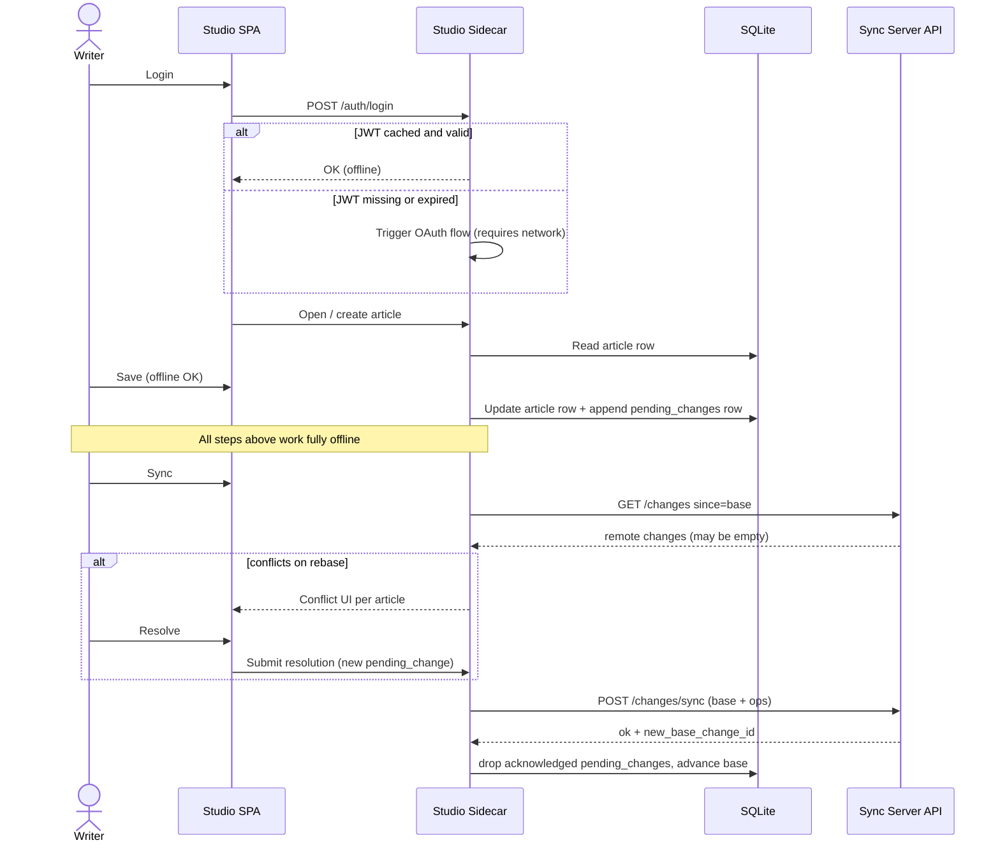

### 10.4 Editor: publish to GitHub Pages

```mermaid
sequenceDiagram
    actor Editor
    participant Studio as Studio SPA
    participant Sidecar as Studio Sidecar
    participant API as Sync Server API
    participant CL as ChangeLogSvc
    participant Pub as PublishSvc
    participant GH as GitHub publishing repo
    participant GHA as GitHub Action
    participant Pages as GitHub Pages
    participant Status as StatusSvc
    participant Notif as NotifSvcS

    Editor->>Studio: Open review queue
    Studio->>Sidecar: GET /sites/{id}/articles?review_status=ready_for_review
    Sidecar->>API: list Ready for review Articles
    API->>CL: query Articles where latest_draft != published and ready_for_review
    CL-->>API: Articles + diff (published_revision vs latest_draft_revision)
    API-->>Studio: review payload
    alt Editor decides to Publish
        Editor->>Studio: Publish article X
        Studio->>Sidecar: POST /articles/{X}/publish
        Sidecar->>API: publish Article X
        API->>CL: advance published_revision = latest_draft_revision; clear review_status
        CL->>Pub: trigger publish (synchronous in the request)
    else Editor decides to Send back
        Editor->>Studio: Send back article X with comment
        Studio->>Sidecar: POST /articles/{X}/send-back
        Sidecar->>API: send back Article X
        API->>CL: clear review_status; persist comment
        Note over API,Pub: No publish triggered
    end
    Pub->>GH: git push sites/<site-slug>/* via PAT
    Pub->>API: record latest_pushed_commit for Site
    GH->>GHA: workflow trigger (push to main of publishing repo)
    GHA->>GHA: astro build every Site independently
    GHA->>Pages: deploy artifact
    API->>Notif: emit "published" event
    Notif->>Notif: enqueue email to every Subscriber of the Site

    loop Vercel Cron + on-demand
        Status->>Pages: GET /easy-cms/slug/version.json
        Pages-->>Status: { commit }
        alt commit matches latest_pushed_commit
            Status->>API: mark Site live
        end
    end
```

### 10.5 Studio observes publish status

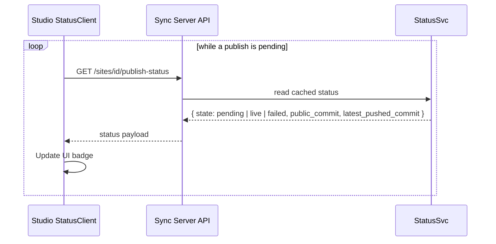

### 10.6 Site visitor with full-site offline reading

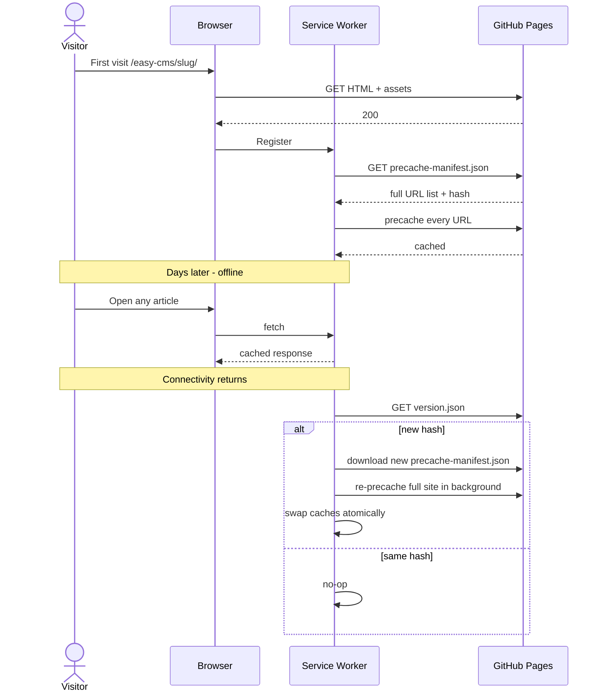

### 10.7 Background JWT refresh

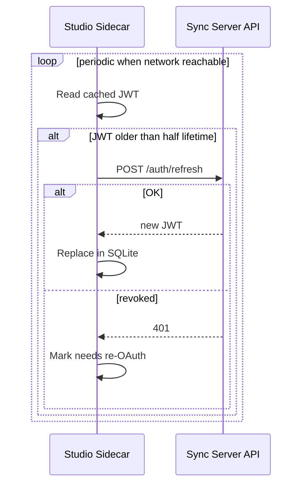

---

## 11. Cross-cutting concerns

- **Offline-first authoring** - every read/write of articles hits only the local clone and SQLite. The network is required only for first OAuth login, JWT refresh, and explicit Sync.
- **Offline-first reading** - the generated Astro site precaches the entire site. Once any visitor has connected at least once, the entire site continues to be readable indefinitely while offline; new content is fetched in the background whenever connectivity returns. This is the central use case (areas with weekly connectivity windows).
- **Independence from server availability** - because the visitor experience runs from cached static assets, neither a Sync Server outage nor a GitHub Pages outage interrupts reading; only updates pause.
- **Auth model** - Google OAuth -> HMAC-signed JWT issued by the Sync Server -> bearer auth for every API call. No passwords stored anywhere. See ADR 0002.
- **Conflict resolution** - per-Article in the change log. The Studio rebases the local pending queue on top of remote Revisions before sync; conflicts surface a three-pane merge UI; resolutions become new pending changes (idempotent on retry). See section 5.
- **Multi-tenancy isolation** - all data scoped by `site_id` in Supabase Postgres (with row-level security policies if Supabase RLS is enabled). Every API call authorizes against the JWT's `site_id` and `role`.
- **Visibility model** - public by default. Privacy is a non-goal for v1; the `PublishSvc` seam is the integration point for a future paid private-hosting tier. See ADR 0004.
- **Portability** - the Studio is a single-executable bundle that opens a browser window pointing to the local sidecar. See section 13 for packaging alternatives.
- **Security** - HTTPS only; sidecar bound to loopback; PAT scoped to the publishing repo only; OAuth state/nonce checks enforced on the Sync Server; HMAC JWT secret stored on the Sync Server only and rotatable.
- **Observability** - structured logs on Studio and Sync Server with `user_id`, `site_id`, `correlation_id`. Publish attempts and GitHub Action runs are linked to a per-Site `latest_pushed_commit` and surfaced via `StatusSvc`.
- **Plugin surface (future)** - SyncSvc, PreviewSvc, PublishSvc, and NotifSvcS expose hook points so the modularity improvement can layer in without core changes.

### Type safety, linting, and determinism

Type safety is treated as a primary engineering deliverable, not a stylistic preference. The same principles apply uniformly across the Sync Server (Python), the Studio sidecar (Python), and every TypeScript surface (Studio React SPA, Sync Server admin SPA, Astro site template).

- **Communicate intent through types, not runtime checks.** A function's signature should make invalid inputs unrepresentable. Test cases verify behaviour the type system cannot prove (e.g. branch coverage, real I/O), not facts the type system already encodes.
- **Discriminated unions over magic strings.** `op: "create" | "update" | "rename" | "mark_ready" | ...` with a `kind` discriminator is the default for every state and message; `enum`-shaped strings without a tag are forbidden.
- **Custom, explicit exceptions.** Every domain failure is its own exception class (`ConflictDetected`, `RevisionNotFound`, `RoleForbidden`, `JwtRevoked`, `SlugAlreadyTaken`, ...); throwing or catching `Exception` / generic `Error` is forbidden. Each exception declares whether it is recoverable, its HTTP mapping (server side), and its user-facing message.
- **Avoid nullable fields.** A field is optional only when "absent" carries a distinct domain meaning. Nullable-as-shrug ("we'll fill it in later") is forbidden; provide a default, or use a discriminated union.
- **Validate at I/O boundaries only.** Pydantic models on every HTTP request and response, every Supabase row, every JWT claim set, every queue payload, every persisted SQLite row. Once data has been validated and parsed into a typed value, downstream code can trust it without redundant runtime checks.
- **Determinism over runtime polymorphism.** Pure functions where possible; explicit clocks and randomness injected as parameters or providers, not read from the global environment. The same input must produce the same output for the same Article state, the same JWT, the same Git PAT, the same Asset bytes.
- **Strict tooling on every surface.**
  - Python: `mypy --strict`, `ruff` for lint and format, `pyright` in CI as a second opinion. Pydantic v2 models for boundaries; `dataclasses` (frozen, slotted) for internal value objects.
  - TypeScript: `tsc --strict`, `eslint` with strict typed-linting rules, `prettier`. `noUncheckedIndexedAccess` and `exactOptionalPropertyTypes` enabled. Discriminated unions are the default for state.
  - Astro: same TypeScript settings; the build fails on any type error.
- **Lint and type errors are CI failures, not warnings.** A red lint or type check blocks the merge in the same way a red unit test does.

---

## 12. Delivery plan - vertical slices

Development follows vertical slices: every slice cuts through Studio + Sync Server + Site (as relevant) and ends in a deployable, demonstrable user story. No slice ships only one layer of one component. The original spec increments are mapped onto these slices, but the order is dictated by user-visible value and risk reduction.

### Slice 0 - Walking skeleton

Goal: prove the end-to-end pipeline with a single hardcoded site, single user, no roles.

- Monorepo scaffolding for `apps/studio`, `apps/sync-server`, `apps/site-template`, `apps/publishing-repo-template`, `packages/design-system`.
- Sync Server: deployed to Vercel; Supabase project provisioned with `users`, `sites`, `change_log` tables; JWT issued by a `/dev/login` endpoint (no OAuth yet); minimal `ChangeLogSvc` accepting a single article-create op; `PublishSvc` that pushes to the GitHub publishing repo via PAT.
- Studio: minimal SPA shell + sidecar; a `/dev/login` button gets a JWT; one hardcoded article `hello.md` is created in SQLite, queued, and posted to the Sync Server.
- Site template: minimal Astro layout, no service worker yet.
- GitHub Action: builds every site folder and deploys to Pages.
- Demo: editing `hello.md` in the Studio results in an updated `https://elc.github.io/easy-cms/<slug>/` within minutes.

### Slice 1 - Article CRUD on a single Site

Goal: a real authoring loop on top of the skeleton.

- Studio: Article list, Markdown editor, create / rename / Soft delete, every save produces a Revision in SQLite and a `pending_changes` row.
- Sync Server: surface Site metadata over `/sites/me`; persist Revisions per Article.
- Site template: index page that lists every Article and renders Markdown; emit Former-slug HTML stubs for Article renames.
- Demo: a user creates several Articles, edits them, syncs, and they appear on the public site after a Publish.

### Slice 2 - Google OAuth and persistent JWT

Goal: replace the dev login with the real auth model.

- Sync Server: `/auth/google/start`, callback, ID-token verification, HMAC-signed JWT with `token_version`, `/auth/refresh`.
- Studio sidecar: OAuth bridge via system browser + loopback callback, JWT cache in SQLite, background refresh loop.
- Demo: cold-start Studio prompts Google sign-in once; subsequent launches work offline against the cached JWT.

### Slice 3 - Live preview and site template polish

Goal: writer sees what readers will see, before publishing.

- Studio: `PreviewSvc` runs Astro locally against the working tree; a preview pane mirrors the editor.
- Site template: typography, navigation, article metadata, basic theming.
- Demo: edits in the Markdown editor reflect in the preview pane within seconds; the published site looks identical.

### Slice 4 - Full-site offline reading

Goal: deliver the core differentiator of the public-site experience.

- Site template: service worker, `precache-manifest.json` emission during the build, `version.json` per site, cache-first runtime strategy with atomic cache swap.
- Studio: a small dev hint about expected total cache size per site.
- Demo: visit the site online, go offline (airplane mode), navigate every article successfully; reconnect, push a new article, observe the service worker re-precache in the background without disrupting reading.

### Slice 5 - Publish status feedback

Goal: close the loop between the Studio and what is actually live.

- Sync Server: `StatusSvc` that polls `version.json` on GitHub Pages and compares with the latest pushed commit per site.
- Studio: `StatusClient` that polls the Sync Server and renders a `pending` / `live` / `failed` badge per site.
- Demo: after publishing, the Studio shows "pending" and flips to "live" once the GitHub Action completes.

### Slice 6 - Writer/Editor roles and the review state machine

Goal: introduce collaboration with role enforcement and the In-progress / Ready-for-review / Published state machine.

- Sync Server: role-aware authorization on every API call. Article rows gain `review_status` (`in_progress` | `ready_for_review`) and `published_revision_id`. Writer endpoints append Revisions and toggle `mark_ready`. Editor-only endpoints `publish`, `send_back`, `unpublish` enforce role and trigger `PublishSvc` only on Publish.
- Studio: review queue for Editors (lists Articles in `Ready for review` with diffs of `published_revision` vs `latest_draft_revision`); Send-back UI with optional comment; per-Article three-pane merge UI for cross-Writer conflicts (section 5.4).
- Demo: two Writers edit different Articles concurrently, mark them Ready for review; an Editor Publishes one and Sends the other back with a comment; the public site updates accordingly.

### Slice 7 - Multi-tenant Sites, admin panel, and Initial sync

Goal: one Sync Server hosts many Sites, and a fresh Studio install can hydrate from any of them.

- Sync Server: `TenantSvc`, multi-Site DB schema, `/sites` admin endpoints, Admin Panel SPA for the Platform Admin (create Site by immutable `<site-slug>` and Google email of the future Site Admin). `/sites/{id}/manifest` and per-Article / per-Asset fetch endpoints supporting reverse-chronological iteration.
- Studio: Site selector in the login flow when the JWT carries access to multiple Sites; `InitialSyncSvc` performs the bootstrap (section 5.6) - eager, resumable, non-blocking, with progress UI and the `sync ready` indicator.
- GitHub publishing repo: subfolder layout for multiple Sites; the GitHub Action already iterates over `sites/*`.
- Demo: Platform Admin creates two Sites with different Site Admins; each Site Admin signs in via Google, watches the Initial sync hydrate the Studio newest-first, and lands on their Site fully offline-capable.

### Slice 8 - Site Admin manages users

Goal: Site Admins can grow their team without involving the Platform Admin.

- Sync Server: per-site `UserSvcS` endpoints (invite by Google email, change role, deactivate).
- Studio: Site Admin user-management screens.
- Demo: a Site Admin invites a new Writer by email; the Writer signs in via Google and immediately sees the site in their Studio.

### Slice 9 - Subscribers and email notifications

Goal: external Subscribers (not Site Users) find out about new Articles without checking the Site.

- Site template: a Subscribe form that posts an email to the Sync Server.
- Sync Server: `NotifSvcS` with SMTP, Subscribers table per Site, hook on Publish events. Unsubscribe link in every email.
- Studio: Subscriber management screen for Editors and Site Admins.
- Demo: a visitor subscribes from the public Site; an Editor Publishes an Article; the Subscriber receives an email with a link to the Article.

### Slice 10 - Packaging and field hardening

Goal: ship the Studio as a single executable a non-technical user can run.

- Studio: PyInstaller bundle (per OS), browser auto-open, first-run wizard (Sync Server URL, Google sign-in).
- Conflict UX polish, Studio offline edge cases (token revoked while offline, branch out of sync).
- Operational runbook: PAT rotation, JWT secret rotation.
- Demo: hand the executable to a non-technical user; they run it, sign in with Google, and start writing.

---

## 13. Studio packaging - open question

Goals:

- Single executable per OS (Windows, macOS, Linux).
- UI is rendered in a normal browser window. No native desktop chrome required.
- No external runtime install for the user.

Candidate approaches, with tradeoffs:

- **PyInstaller + auto-open default browser** - simplest. The sidecar bundles Python + FastAPI + the SPA static assets and on launch opens the user default browser to `http://127.0.0.1:PORT`. Pros: trivial to build, smallest learning curve, true single executable. Cons: depends on a browser being installed; UX is a regular tab.
- **PyInstaller + pywebview** - bundles a minimal native webview window pointed at the local sidecar. Pros: dedicated window, still a single Python-based executable. Cons: webview engine varies per OS (Edge WebView2 / WKWebView / WebKitGTK).
- **Tauri shell + Python sidecar** - Tauri provides the window and uses the system webview; the Python FastAPI sidecar runs as a child process bundled inside the Tauri app. Pros: small binary, modern packaging, dedicated window with a clean app feel. Cons: more build complexity (Rust toolchain), two-language packaging story.
- **Electron + Python sidecar** - mature, but heavy binary and not a great fit for a "portable" goal.

Recommendation for v1: PyInstaller + auto-open browser. Re-evaluate Tauri for v2 when the SPA UX is mature enough to justify the extra build pipeline.

---

## 14. Open architectural questions to resolve before coding

- **JWT lifetime** - 30 days proposed; revisit based on observed connectivity patterns of real users.
- **Service worker storage limits** - precaching every site asset assumes article-shaped content; document a soft cap (e.g. 200 MB per site) and a guidance note for site authors on heavy media. Also decide whether to fall back to selective precache when the browser quota is hit.
- **GitHub Action build cost** - rebuilding every site on every push is simple but scales linearly with the number of sites. Set a soft cap on sites per shared publishing repo and split into multiple repos if needed.
- **PAT rotation** - operational process for rotating the publishing PAT without downtime; possibly a secondary PAT in standby on Vercel env vars.
- **Vercel function cold starts on `PublishSvc`** - publish kicks off a `git push` from a serverless function. Confirm the function timeout (default 10 s on hobby, longer on paid) is enough for the worst-case push; if not, move publish to a queued job using Supabase as the queue and Vercel Cron as the worker.
- **Supabase RLS vs. application-level authorization** - either is workable; pick one and apply it consistently before the multi-tenant slice (Slice 7).
- **Studio packaging** - see section 13.
