# Easy CMS - Development Plan

This document is the technical architecture plan for Easy CMS. It is the source of truth for the system's architecture and delivery, alongside [`CONTEXT.md`](../CONTEXT.md) (vocabulary) and the ADRs in [`docs/adr/`](adr/) (hard decisions).

The system is **three-tier**:

- A hosted **Sync Server** for many Sites on Vercel + Supabase.
- A per-user portable **CMS Studio** (FastAPI sidecar + React SPA) that runs on `127.0.0.1`.
- A public **Generated Site** per Site, built with Astro + TypeScript and deployed to GitHub Pages.

**Canonical glossary**: terminology in this document follows [`CONTEXT.md`](../CONTEXT.md). Domain decisions that are hard to reverse are recorded as ADRs:

- [ADR 0001 - JSON change-log protocol](adr/0001-json-change-log-protocol.md)
- [ADR 0002 - Google OAuth + HMAC JWT, no passwords](adr/0002-google-oauth-hmac-jwt-no-passwords.md)
- [ADR 0003 - Service worker precaches the entire Site](adr/0003-service-worker-precaches-entire-site.md)
- [ADR 0004 - Public-by-default on GitHub Pages](adr/0004-public-by-default-github-pages.md)
- [ADR 0005 - Per-Article publication, no global "main"](adr/0005-per-article-publication.md)
- [ADR 0006 - Generated Site Subscribe exception](adr/0006-generated-site-subscribe-exception.md)
- [ADR 0007 - Queue all authorized actions with deterministic state transitions](adr/0007-queue-all-authorized-actions.md)

**Key technology choices** (where they deviate from the original spec):

- **FastAPI** replaces Flask for the Sync Server and the Studio sidecar.
- The CMS Studio browser surface is a **React SPA** with a custom design system (the spec called for Jinja2 templates).
- The public Site is generated with **Astro + TypeScript**, not Pelican.
- Sync Server deploys to **Vercel**; persistent state lives in **Supabase** (Postgres + Storage); the Studio uses local **SQLite**.
- Identity is delegated to **Google OAuth**; no passwords are stored anywhere (ADR 0002).
- Generated Sites live on **GitHub Pages** under `https://elc.github.io/easy-cms/<site-slug>/` (ADR 0004).
- The Generated Site precaches every Article and Asset via a **service worker** so visitors with intermittent connectivity can read the entire Site offline (ADR 0003).
- Type safety, strict linting, and determinism are first-class engineering concerns across every component. See section 11.

---

## 1. System overview

Three runtime components plus an external GitHub-based publication pipeline:

- **Sync Server** (hosted on Vercel, serving many Sites) - FastAPI Vercel Functions for the HTTP interface and the Platform Admin panel SPA. Backed by Supabase Postgres for relational state and Supabase Storage for binary Assets. Owns identity, the change log, and triggers publication.
- **CMS Studio** (per user, portable) - FastAPI sidecar bound to `127.0.0.1` plus a React SPA, with local SQLite as the source of truth for in-progress work. Packaged as a single executable that auto-opens a browser window.
- **Publishing pipeline (external)** - one shared GitHub repo plus a GitHub Action that builds every Site with Astro and deploys to GitHub Pages.
- **Generated Site** (per Site) - static output on GitHub Pages with a service worker that fully precaches every Article and Asset for offline reading.

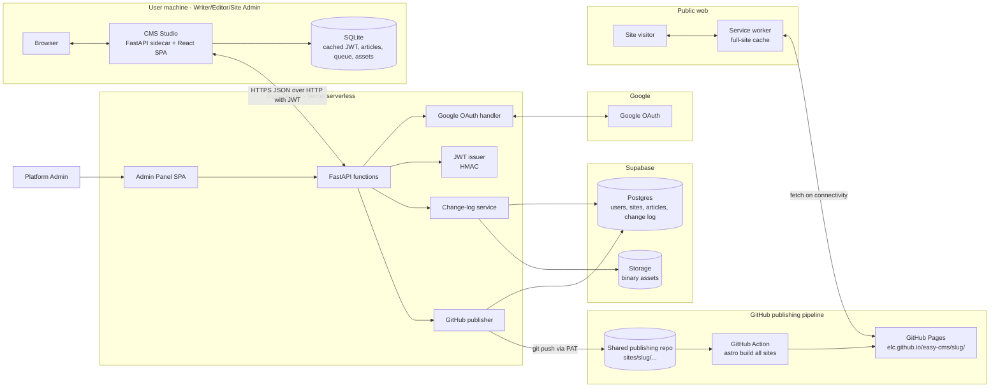

CMS Studio never serves public traffic. The Generated Site reaches back to the Sync Server only through the Subscribe form exception recorded in ADR 0006; Article rendering and offline reading remain static. All other cross-component flow is HTTPS JSON plus Git push to GitHub.

---

## 2. Code monorepo layout

A single repo holds everything that is built and shipped. Per-Site state is a runtime artifact in Supabase, not a Git repo.

- `apps/studio` - CMS Studio. FastAPI sidecar (Python) plus React SPA (Vite + TypeScript). Packaged as a single executable.
- `apps/sync-server` - FastAPI HTTP interface, Platform Admin panel React SPA, GitHub publisher, OAuth handler.
- `apps/site-template` - Astro + TypeScript template (including the service worker) used by the GitHub Action to render every Site.
- `apps/publishing-repo-template` - the seed structure of the shared publishing repo (folder layout, GitHub Action workflow).
- `packages/design-system` - shared React component library plus design tokens, consumed by both `studio` and the Sync Server admin panel.
- `packages/shared-types` - TypeScript types and OpenAPI-derived HTTP helpers shared across browser surfaces.
- `packages/python-shared` - shared Python domain models / DTOs between Studio and Sync Server.
- `infra/` - Dockerfiles and deploy manifests for the Sync Server.

---

## 3. Authentication

The system never stores user passwords. Identity is delegated to Google; the Sync Server issues a long-lived HMAC-signed JWT after a successful OAuth roundtrip. The JWT is the only credential the Studio uses against the Sync Server. See ADR 0002.

- **OAuth provider**: Google. Scopes: `openid email profile`.
- **JWT**: HMAC-SHA256, secret stored only on the Sync Server (Vercel environment variable). Claims: `sub` (Sync Server user id), `email`, `site_id`, `role`, `token_version`, `iat`, `exp`. Lifetime: 30 days.
- **Refresh**: the Studio attempts a silent refresh whenever connectivity is available and the JWT is older than half its lifetime. If refresh fails because the user record is disabled or revoked, the Studio surfaces a re-login prompt.
- **Bypass after first login**: as long as the cached JWT is valid, no Google round-trip is needed. The Studio works fully offline using the cached JWT.
- **Wire protocol**: HTTPS plus JSON. All CMS-Studio-to-Sync-Server traffic uses `Authorization: Bearer <jwt>`.
- **Provisioning**: the Platform Admin creates a Site by entering the future Site Admin's Google email; a pre-activated Site User record is created in Supabase. On first OAuth login the email is matched and the account is activated. Editors and Writers are likewise added by email and activated on first OAuth login.
- **Revocation**: deleting a user or rotating the JWT secret invalidates outstanding tokens. Per-token revocation is achieved by storing a `token_version` on the user row; the JWT carries the version and is rejected if it does not match.

---

## 4. Sync Server architecture

The Sync Server is the authority for identity, Sites, and the canonical change log. It runs as FastAPI Vercel Functions; all persistent state lives in Supabase. It does not build or host the Generated Site.

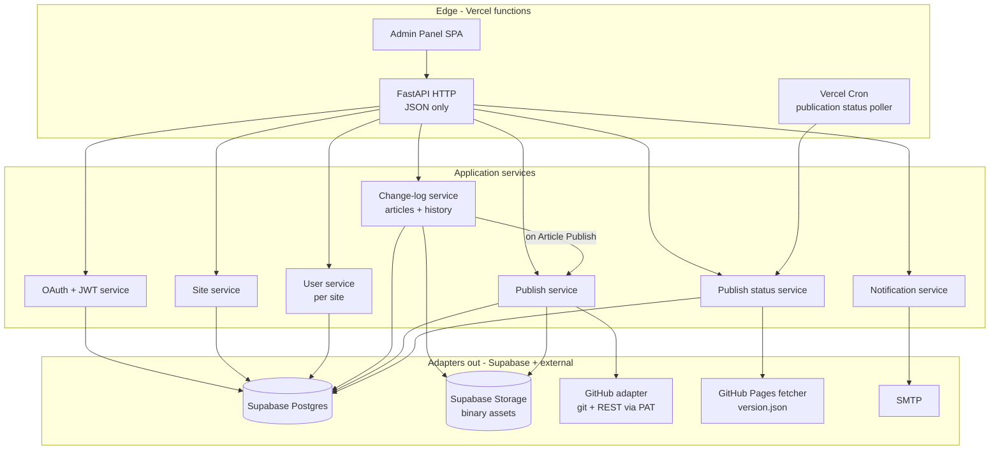

Key responsibilities:

- **SiteSvc** - creates a Site (DB rows plus seed change log plus initial Site config) and assigns one Site Admin by Google email.
- **AuthSvc** - performs the Google OAuth dance, looks up or activates the user by email, issues HMAC JWTs, validates them on every request.
- **UserSvcS** - per-Site user/role storage scoped by `site_id`. No password column.
- **ChangeLogSvc** - the heart of the wire protocol. Accepts ordered batches of changes from CMS Studio (see section 5), persists them to Supabase Postgres as immutable Revision rows, advances each Article's `latest_draft_revision` pointer, and returns conflicts when a CMS Studio's base does not match the Sync Server state. Tracks Article state transitions (In progress, Ready for review, Published, Unpublished, Deleted). Binary Assets live in Supabase Storage and are referenced from the Site-wide Asset library.
- **PublishSvc** - on every Article Publish, exports the current Site state (every Article whose `published_revision` is set, the Asset library, the `precache-manifest.json`, and `version.json`) to the shared publishing repo at `sites/<site-slug>/` and pushes via the fine-scoped PAT. Records the published GitHub commit hash per Site in Postgres.
- **StatusSvc** - on a Vercel Cron schedule (e.g. every minute) and on demand, fetches `https://elc.github.io/easy-cms/<site-slug>/version.json` for Sites with publication in progress. Updates the `public_commit` column on the Site row and exposes status per Site to CMS Studio.

---

## 5. Offline operation queue and conflict resolution

How CMS Studio queues work done offline, applies deterministic state transitions, and resolves Article content conflicts when reconnecting.

### 5.1 Data model in the Studio (SQLite)

- `articles` - one row per Article (`article_id`, `slug`, `former_slugs`, `review_status: in_progress | ready_for_review`, `is_deleted`, `known_revision_id`, `published_revision_id`).
- `revisions` - immutable snapshots of an Article's content (`revision_id`, `article_id`, `parent_revision_id`, `body_markdown`, `front_matter`, `created_at`, `created_by`).
- `queued_changes` - ordered queue of local mutations not yet acknowledged by the Sync Server. Each row: `id` (monotonic), `scope` (`article | asset | site_user | subscriber | site_settings`), `article_id` when scoped to an Article, `op` (`create_article | update_article | rename_article | mark_ready | unmark_ready | publish | send_back | unpublish | delete_article | restore_article | hard_delete_article | create_asset | delete_asset | invite_site_user | change_site_user_role | deactivate_site_user | add_subscriber | remove_subscriber | update_site_settings`), `payload`, `base_revision_id` when scoped to Article content, `created_at`. Op-level UUIDs make replays idempotent.
- `assets` - local cache of Site-wide Asset library entries (`asset_id`, local path, `content_hash`, `uploaded`).

CMS Studio is the source of truth for in-progress local work; the Sync Server is the source of truth for everything else. There is no local Git working tree on the sync path; an optional read-only history view can be reconstructed from the `revisions` table for the user.

### 5.2 Wire protocol (JSON)

- `POST /sites/{id}/changes/sync`
  - request: `{ base_change_id, changes: [queued_changes...] }`
  - response: `{ applied: [...], superseded: [...], conflicts: [...], new_base_change_id }`
  - `applied` lists changes committed to the canonical change log.
  - `superseded` lists Superseded changes with a user-facing reason and the newer Article or Site state that caused the outcome.
  - `conflicts` is reserved for Article content changes that require CMS Studio conflict-resolution UI.
- `GET /sites/{id}/changes?since={change_id}` - pull updates from other users.
- Asset storage: `POST /sites/{id}/assets` with the binary, returns a stable URI. Stored eagerly when online; the queue only holds the URI reference.

The protocol is idempotent: an `op` carries a CMS-Studio-generated UUID, and replaying it after a network glitch is a no-op on the Sync Server.

### 5.3 Sync algorithm

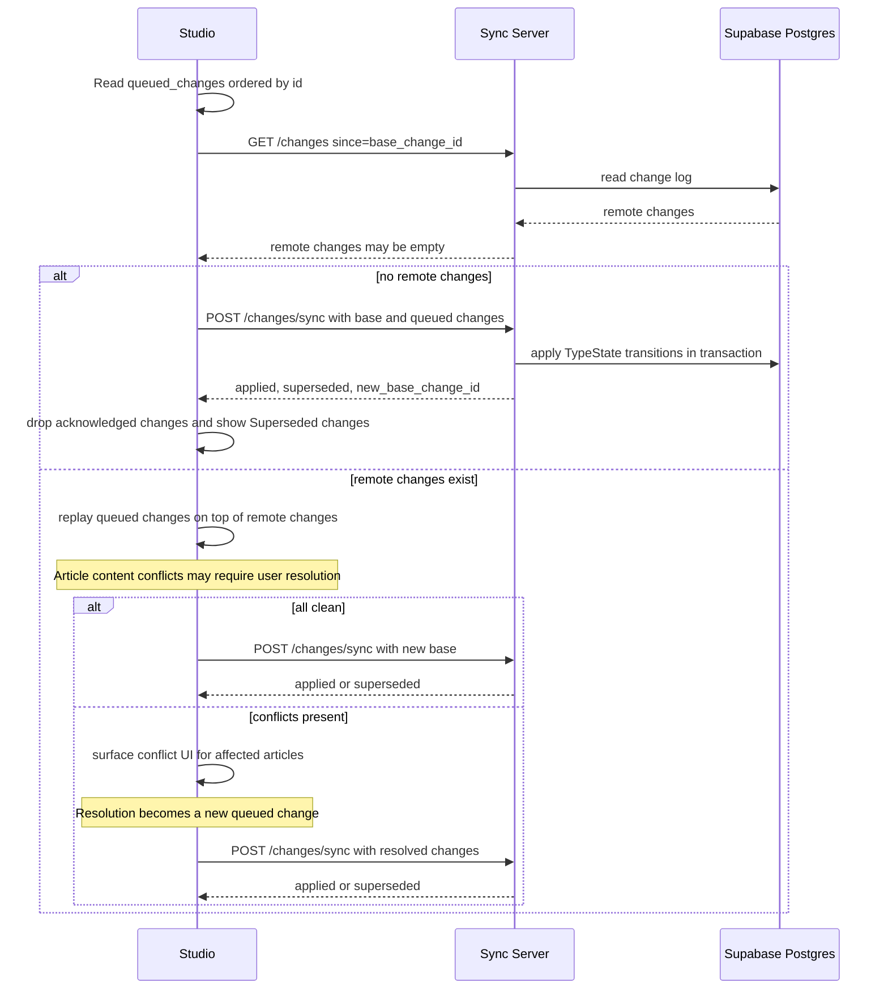

### 5.4 Deterministic TypeState transitions

All queued changes are authorized again when they reach the Sync Server. A valid queued change is either applied or recorded as a Superseded change; it must never partially mutate state. The Sync Server runs transitions in canonical change-log order, and each transition receives a typed input state and returns a typed output state.

- Article content changes (`create_article`, `update_article`, `rename_article`, `delete_article`, `restore_article`) can produce content conflicts that require CMS Studio resolution.
- Editorial changes (`mark_ready`, `unmark_ready`, `publish`, `send_back`, `unpublish`) never open the conflict UI. They are applied only if the Article is still in a compatible state.
- If one Editor queues Publish and another queues Send back for the same Ready for review Article, arrival order decides the result. If Send back applies first, the later Publish is a Superseded change. If Publish applies first, the later Send back is a Superseded change and does not Unpublish the Article.
- Site User changes and Subscriber changes are applied only if their target still exists and the acting Site User still has the required role. Otherwise they become Superseded changes with a notification for the acting CMS Studio.
- Hard delete applies only to a soft-Deleted Article with no newer queued content changes. If it applies first, later Article changes for that Article become Superseded changes.

### 5.5 Conflict-resolution UX in CMS Studio

- Conflicts are detected per Article. The Studio shows a side-by-side three-pane view of Revisions: `base`, `mine`, `theirs`. The user picks per chunk or pastes a final Revision.
- The resolution is recorded as a new `queued_changes` row with `base_revision_id` set to the Sync Server Revision id for that Article. The resolution is itself an idempotent op that will succeed on the next sync.
- If the user is still offline after resolving, the resolved op waits in the queue.
- Superseded changes do not use the conflict UI. CMS Studio shows them as notifications with the acting user's change, the resulting canonical state, and the reason the change was superseded.
- Special cases: a delete-vs-edit conflict surfaces as a binary choice; a Slug-rename-vs-edit conflict reapplies the edit on the renamed Article and adds the old Slug to `former_slugs`.

### 5.6 Why not Git smart-HTTP from CMS Studio

ADR 0001 records this in detail. In short: Vercel Functions rule out hosting bare Git repositories on the Sync Server. Two alternatives were considered (push directly to a private GitHub repo per Site, or self-host Git on a small VPS) and rejected. The JSON change-log protocol keeps deployment fully serverless, gives CMS Studio precise control over conflict UX, and still lets the Sync Server export to a real Git repo (the GitHub publishing repo) when it is time to deploy.

### 5.7 Initial sync

The first time a Site User signs in to a Site (or after a wipe/reinstall), the Studio performs an Initial sync that hydrates the local SQLite tables with every Article and every Asset for the Site.

- **Strategy**: eager. CMS Studio downloads every Article's Latest draft revision and every Asset; the goal is that the user is fully offline-capable the moment the Initial sync finishes and stays that way through their next connectivity window.
- **Order**: reverse-chronological (newest content first). Most recent work is what the user is most likely to need; if the user disconnects mid-bootstrap, what is already on disk is the most useful subset.
- **Resumable**: each downloaded Article and Asset is committed to SQLite immediately. The Studio remembers the last `revision_id` and `asset_id` it confirmed; on resume it picks up from there. Network interruption does not lose work.
- **Non-blocking**: Initial sync runs in the background. The user can immediately start creating new Articles; new Articles enter the local SQLite and the offline queue exactly as they would after the bootstrap is complete.
- **Progress UI**: an optional progress bar with ETA shows current item, total items, and bytes remaining. A persistent "sync ready" indicator in the Studio's chrome flips on once the Initial sync completes.

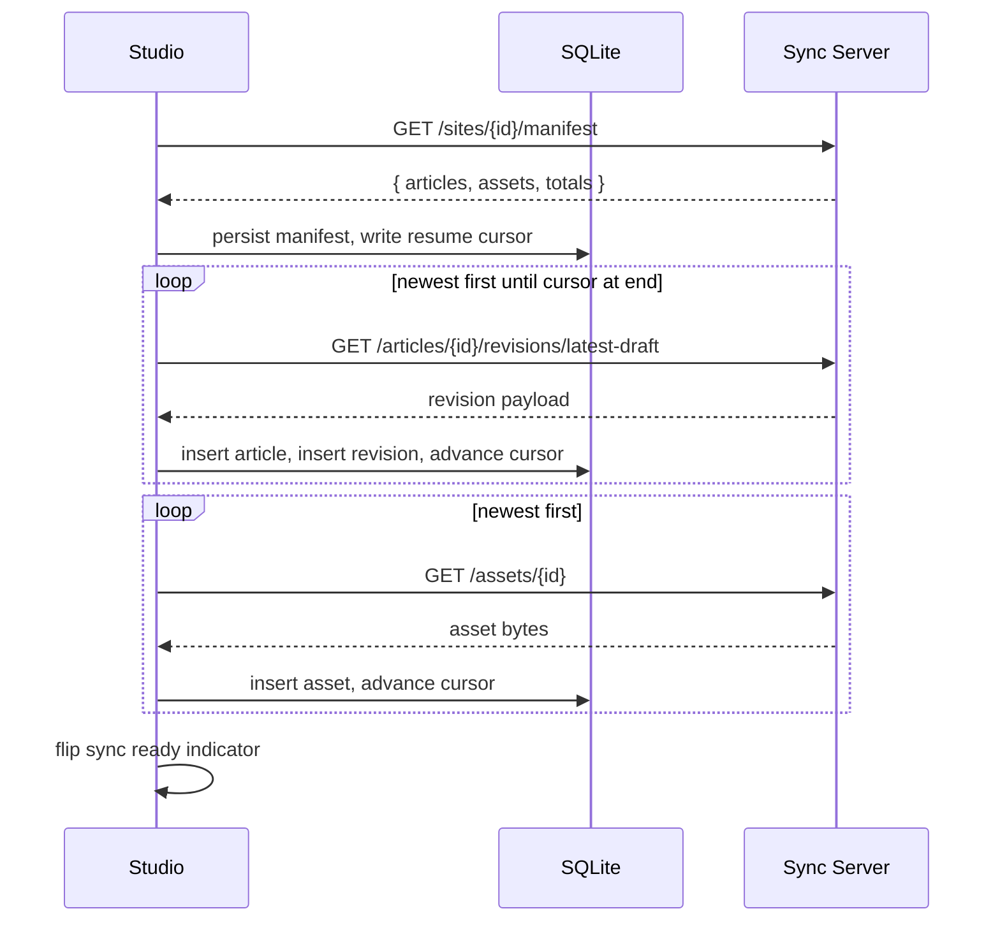

### 5.8 Asset lifecycle

Assets are immutable by content hash in v1. Replacing an Asset creates a new Asset entry; the old Asset remains available while any Article Revision or Site setting still references it.

- **Identity**: `asset_id` is stable and generated by the Sync Server. `content_hash` is SHA-256 over the bytes and is unique per Site. Duplicate bytes reuse the existing Asset record and URI.
- **Storage key**: Supabase Storage keys use `sites/<site_id>/assets/<content_hash>/<safe_name>`. The safe name is display-only; Article references use the stable Asset URI returned by the Sync Server.
- **Validation**: the Sync Server enforces an allowlist of MIME types, maximum byte size per Asset, and maximum aggregate Asset size per Site. The CMS Studio validates the same limits before queueing a change, but the Sync Server remains authoritative.
- **Replacement**: selecting a different binary object for an Article inserts a new Asset if the content hash is new, then creates an Article Revision that points to the new Asset URI.
- **Deletion**: an Asset can be deleted from the Site Asset library only when no Article Revision, Published revision, Former slug stub, Site config, Atom feed, or social metadata references it. Attempting to delete an in-use Asset becomes a Superseded change with the referencing objects listed.
- **Offline handling**: CMS Studio can queue Article changes that reference local Asset bytes. Sync uploads the Asset bytes first, rewrites the queued Article payload to the returned Asset URI, then posts the Article change. If the Asset cannot be stored, the Article change stays queued and visible to the Site User.

---

## 6. Publishing pipeline (GitHub Pages)

A single shared GitHub repo holds the publishable source for every Site, organized by slug. A GitHub Action rebuilds and redeploys on every push.

- **Repo layout**:
  - `sites/<site-slug>/content/` - Markdown Articles and references to Assets, exported by the Sync Server.
  - `sites/<site-slug>/site.config.json` - per-Site config (title, theme overrides, base path).
  - `template/` - the Astro Site template imported as a workspace package by every per-Site build.
  - `.github/workflows/build-and-deploy.yml` - the GitHub Action.
- **Workflow**:
  1. Trigger: `push` on the publishing repo's `main` with path filter `sites/**`.
  2. Detect every Site under `sites/*` (no diff filtering: every Site is rebuilt independently to keep the action simple and deterministic).
  3. For each Site, run `astro build` with `--base /easy-cms/<site-slug>/` and write into `dist/<site-slug>/`.
  4. Generate `dist/<site-slug>/version.json` containing the source commit hash for that Site, and `dist/<site-slug>/precache-manifest.json` listing every address the service worker should precache.
  5. Generate `dist/<site-slug>/sitemap.xml`, `dist/<site-slug>/atom.xml`, canonical metadata, and basic social metadata for every Published revision.
  6. Upload the combined `dist/` as the GitHub Pages artifact and deploy.
- **Output address**: `https://elc.github.io/easy-cms/<site-slug>/`.
- **Visibility**: public by default; private hosting is out of scope (ADR 0004). The `PublishSvc` boundary is the integration point where a future paid private-hosting tier can target an alternative sink.

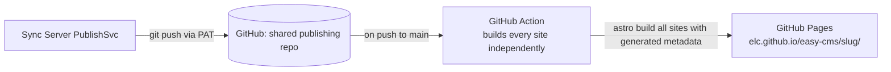

---

## 7. Generated Site - offline reading

The Site Visitor experience is read-only and account-less. The service worker is the linchpin of offline support (ADR 0003).

- **Caching strategy**: precache the entire Site shell, every Article, and every Asset on first visit. The use case explicitly assumes scarce connectivity (a visitor may connect once a week and must keep reading until the next sync).
- **Manifest**: the GitHub Action emits `precache-manifest.json` listing every URL produced by the build, plus a hash. The service worker reads this on install and re-install and downloads the full set.
- **Update detection**: the service worker checks `/easy-cms/<site-slug>/version.json` whenever connectivity is available. If the hash differs from what was cached, it triggers a background full re-precache. The previous cache is kept until the new one is fully populated, so users never lose offline access mid-update.
- **Runtime strategy**: cache-first for everything. The service worker falls back to the cached version on any network failure, including DNS errors (so a Sync Server outage or GitHub Pages outage is invisible to the visitor).
- **No login**: the public Site has no authentication or personalization. All readers see the same content.
- **Former-slug redirects**: every Former slug is emitted as a small HTML stub at the old URL, with a `<meta http-equiv="refresh">` to the current Slug and a `<link rel="canonical">` to the same. These stubs are part of the precache manifest so even old bookmarks resolve offline.
- **Site slug is immutable**: the Site's `<site-slug>` is part of every URL; it is fixed at Site creation time and cannot be renamed. Article Slugs can change freely (Former slug behaviour applies).

### 7.1 Discovery and metadata

The Generated Site emits discovery artifacts during every publication:

- `sitemap.xml` lists every Published revision and every Former slug stub with canonical metadata pointing at the current Slug.
- `atom.xml` lists the most recent Published revisions for the Site, ordered by Publish time. Atom is the only feed format in v1.
- Each Article HTML output includes canonical metadata, Open Graph title/description/image fields when available, and a stable publication timestamp from the Published revision.
- The Generated Site build fails if two Published revisions claim the same canonical address, if a Former slug points to a missing Article, or if Atom metadata cannot be generated deterministically.

### 7.2 Subscribe exception

ADR 0006 allows one exception to the otherwise static Generated Site boundary: the Subscribe form may submit an email address to a public Sync Server endpoint for that Site.

- The endpoint accepts only `{ site_slug, email, honeypot, timestamp, nonce }` and returns a generic success response.
- The Sync Server rate limits by IP and Site, validates the nonce, stores only normalized email plus Site id, and sends a confirmation or unsubscribe-capable email through `NotifSvcS`.
- The Generated Site does not fetch Article data, Site User data, or personalized state from the Sync Server.
- If the Subscribe request fails, the Generated Site shows a non-blocking message; offline reading is unaffected.

---

## 8. CMS Studio architecture

CMS Studio is a portable single-Site authoring surface.

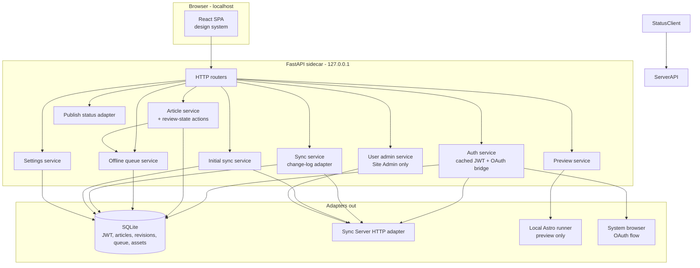

Key responsibilities:

- **AuthSvcL** - JWT cache. On first login (or when the JWT is missing or invalid) opens the system browser to the Sync Server OAuth start URL and listens on a loopback callback, then exchanges the code for a JWT. Stores the JWT in SQLite.
- **ArticleSvc** - CRUD on Articles in SQLite, plus review-state actions (`mark_ready`, `unmark_ready`) for Writers and Editor actions (`publish`, `send_back`, `unpublish`). Every local mutation produces a Revision when Article content changes and enqueues a `queued_changes` row via `QueueSvc`.
- **QueueSvc** - manages the offline queue (append, list, drop on acknowledgement, idempotency-key generation, Superseded change notifications). The queue order is the user's intent order; the Sync Server reconciles conflicting order from other CMS Studios at sync.
- **SyncSvc** - implements the change-log protocol against the Sync Server: pulls remote Revisions, replays the local queue, posts the queue, surfaces per-Article content conflicts to the SPA, and records Superseded change outcomes.
- **InitialSyncSvc** - drives the Initial sync (section 5.6): manifest fetch, reverse-chronological download, resume, progress reporting.
- **PreviewSvc** - runs Astro locally against the SQLite-backed Articles to render a live preview pane.
- **UserSvcL** - enqueues Site User changes locally and delegates final authorization to the Sync Server; only Site Admins can call it in CMS Studio.
- **StatusAdapter** - polls Sync Server for publish status (live / publication in progress / failed) and surfaces it as a badge in the UI.

---

## 9. Roles

All roles inherit the privileges of those below them. A single user wearing multiple hats is the expected model on small Sites.

- **Platform Admin** - operates the Sync Server. Uses the Admin Panel SPA. Creates Sites, provisions Site Admins by Google email. Does not touch Site content.
- **Site Admin** - top-level role per Site. Manages Site Users and Site settings. Has Editor and Writer privileges. Site Admin is also the only role that can Hard delete Articles.
- **Editor** - reviews Articles in `Ready for review` state and either Publishes them (advances `published_revision`, triggers `PublishSvc`), Sends them back (returns to `In progress` with an optional comment), or Unpublishes a previously Published Article. These actions are queueable and become applied or Superseded changes when the Sync Server processes them. Has Writer privileges. An Editor cannot edit a `Ready for review` Article without first Sending it back.
- **Writer** - creates, edits, renames, and Soft-deletes Articles. Marks an Article as `Ready for review` when done; can undo the marking until the Editor acts on it.
- **Site Visitor** - public, anonymous, read-only access via GitHub Pages. No account; offline reading via the service worker.
- **Subscriber** - email address registered through the Generated Site's Subscribe form. Receives a notification on each Publish for that Site. Distinct from a Site User; never logs in.

---

## 10. User flows (sequence diagrams)

### 10.1 Platform Admin creates a Site and pre-registers a Site Admin

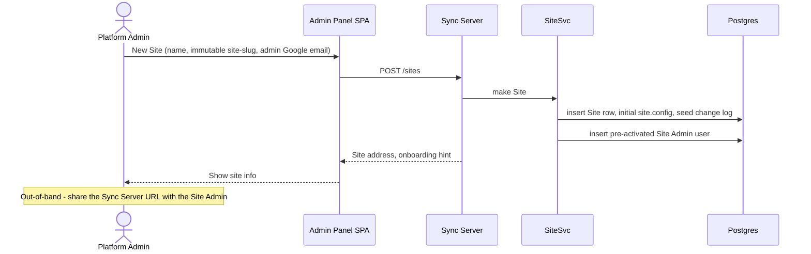

### 10.2 Site Admin first login via Google OAuth

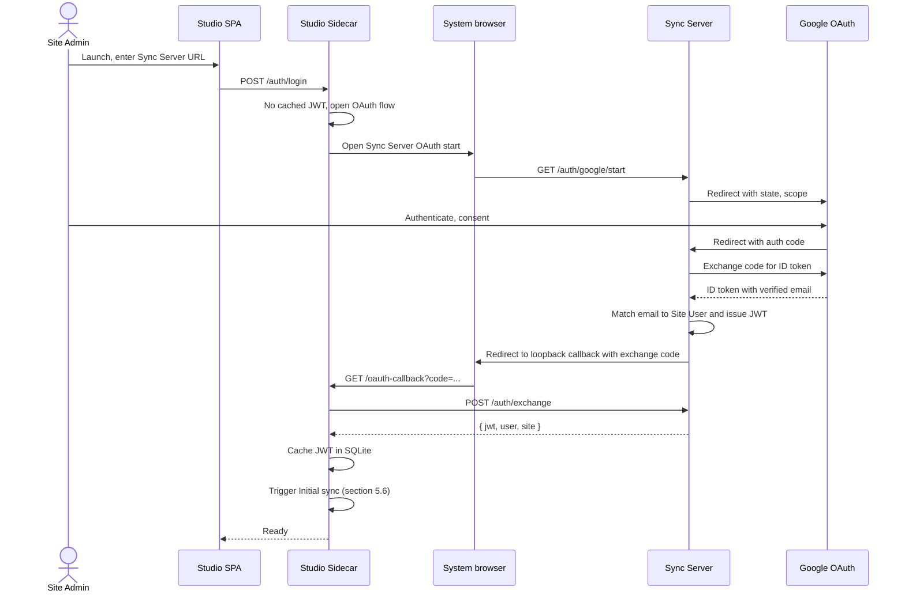

### 10.3 Writer: edit and sync (offline-tolerant)

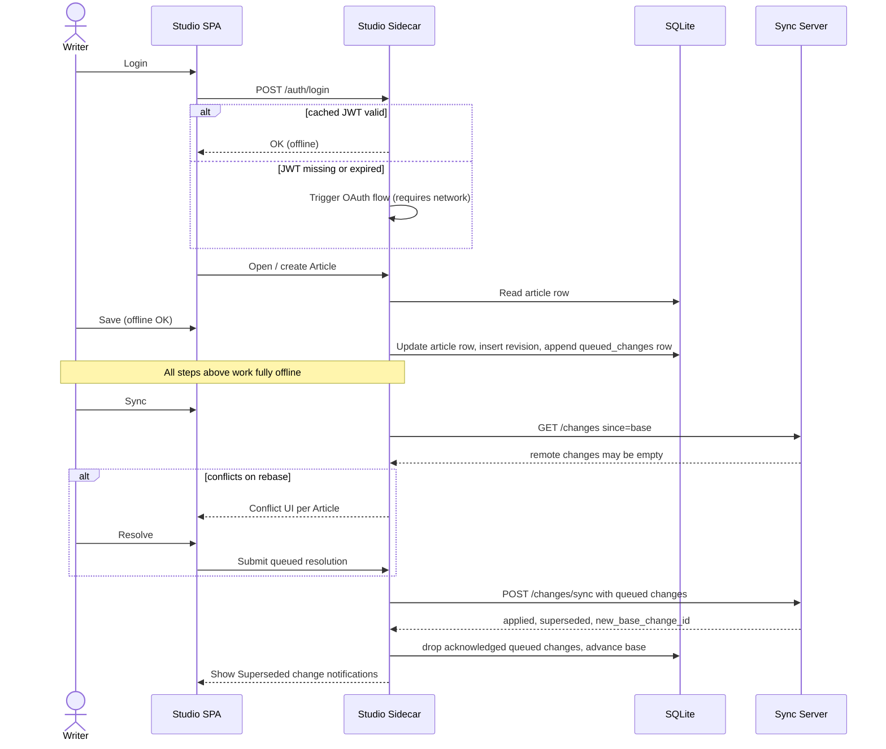

### 10.4 Editor: review, publish or send back

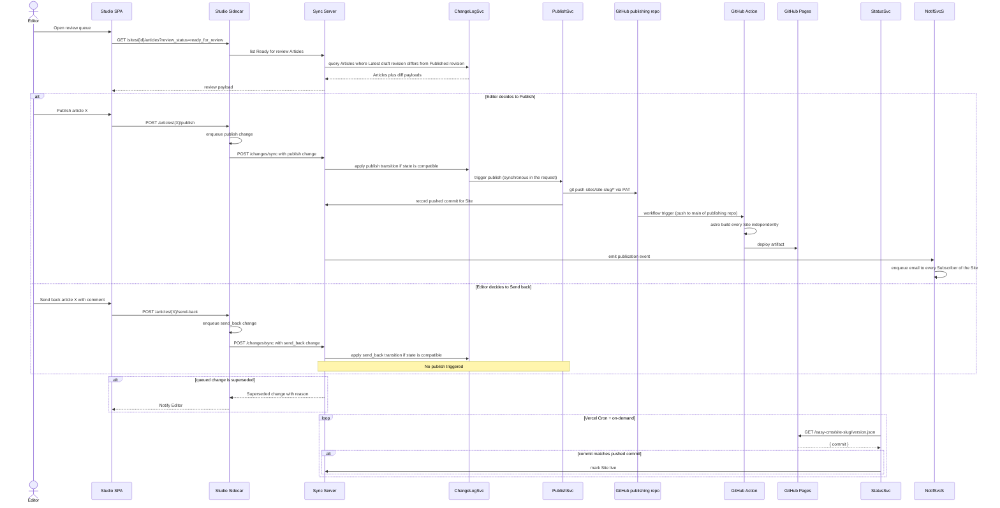

### 10.5 Studio observes publish status

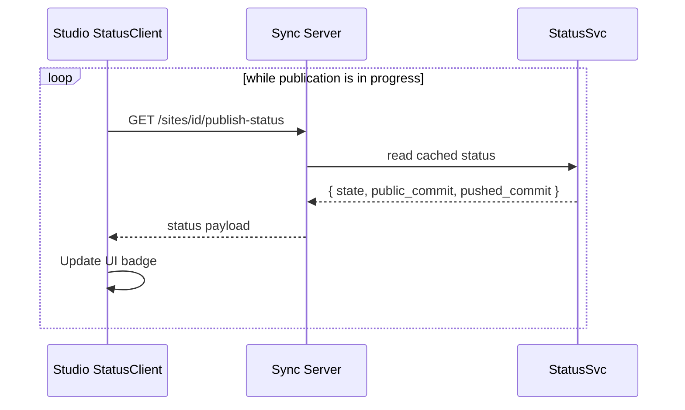

### 10.6 Site Visitor with full-Site offline reading

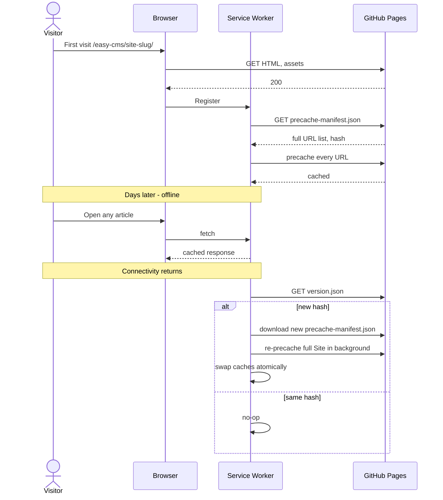

### 10.7 Background JWT refresh

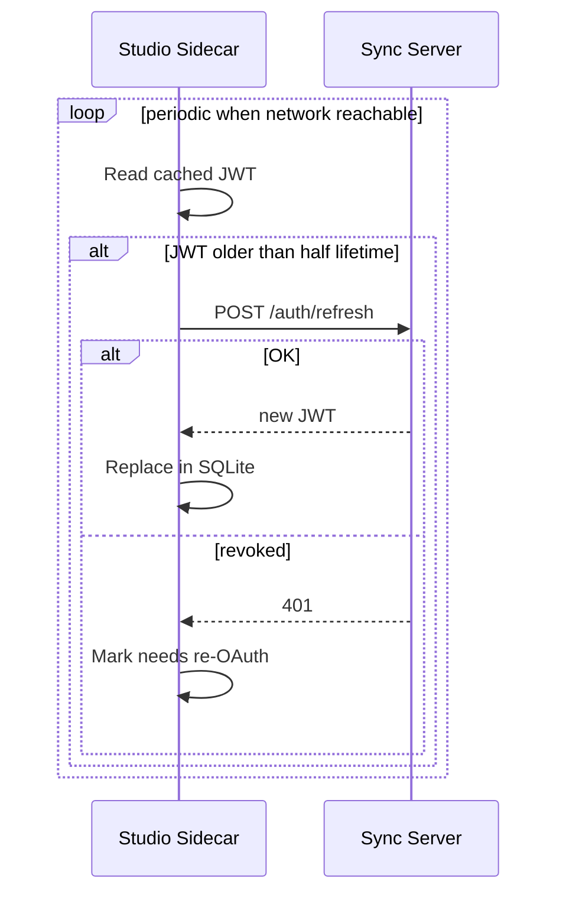

---

## 11. Cross-cutting concerns

- **Offline-first authoring** - every read/write of Articles hits only local SQLite. The network is required only for first OAuth login, JWT refresh, Initial sync, and explicit Sync; all role-authorized changes can be queued.
- **Offline-first reading** - the Generated Site precaches every Article and Asset (ADR 0003). Once any visitor has connected at least once, the entire Site continues to be readable indefinitely while offline; new content is fetched in the background whenever connectivity returns. This is the central use case (areas with weekly connectivity windows).
- **Independence from server availability** - because the visitor experience runs from cached static assets, neither a Sync Server outage nor a GitHub Pages outage interrupts reading; only updates pause.
- **Auth model** - Google OAuth then HMAC-signed JWT issued by the Sync Server then bearer auth for every Sync Server request. No passwords stored anywhere (ADR 0002).
- **Conflict resolution** - per-Article in the change log. CMS Studio replays the local queue on top of remote Revisions before sync; Article content conflicts surface a three-pane conflict UI; resolutions become new queued changes (idempotent on retry). Non-content races become applied or Superseded changes. See section 5.
- **Site isolation** - all data scoped by `site_id` in Supabase Postgres. Every Sync Server request authorizes against the JWT's `site_id` and `role` in a FastAPI dependency before any query runs (application-level authorization, see section 14). Supabase RLS is not enabled for v1.
- **Visibility model** - public by default. Privacy is a non-goal for v1; the `PublishSvc` boundary is the integration point for a future paid private-hosting tier (ADR 0004).
- **Portability** - the Studio is a single-executable bundle that opens a browser window pointing to the local sidecar. See section 13 for packaging alternatives.
- **Security** - HTTPS only; sidecar bound to loopback; PAT scoped to the publishing repo only; OAuth state/nonce checks enforced on the Sync Server; HMAC JWT secret stored on the Sync Server only and rotatable.
- **Observability** - structured logs on CMS Studio and Sync Server with `user_id`, `site_id`, `correlation_id`. Publish attempts and GitHub Action runs are linked to a per-Site pushed commit and surfaced via `StatusSvc`.
- **Plugin surface (future)** - SyncSvc, PreviewSvc, PublishSvc, and NotifSvcS expose hook points so the modularity improvement can layer in without core changes.

### Database schema and migrations

- Supabase Postgres tables are managed with versioned SQL migrations checked into `apps/sync-server/migrations`. Every migration has an idempotent rollback note, even when the rollback is "restore from backup".
- Required v1 tables: `sites`, `site_users`, `articles`, `revisions`, `change_log`, `queued_change_receipts`, `assets`, `asset_references`, `subscribers`, `publish_attempts`, and `audit_events`.
- Hard invariants live in the database as constraints where possible: unique Site slug, unique Article Slug per non-Hard-deleted Article, unique Former slug per Site, immutable Revision rows, unique Asset `content_hash` per Site, and no Subscriber duplicate per Site.
- SQLite schema changes in CMS Studio use monotonic migrations with a compatibility check at startup. If the local schema is newer than the executable understands, CMS Studio refuses to open the Site and tells the user to install a newer executable.
- Supabase Storage keys are derived from Site id plus Asset content hash; Postgres remains the source of truth for whether an Asset is visible in the Site Asset library.

### Testing strategy

- Unit tests cover pure TypeState transition functions, Slug and Former slug invariants, JWT validation, Asset validation, Atom generation, and service worker manifest generation.
- Integration tests use real SQLite and a local Postgres-compatible test database for sync, Initial sync, Asset storage metadata, and publication status flows.
- End-to-end tests cover the core vertical stories: first login, Article creation, queued offline work, conflict resolution, Publish, Send back, Superseded change notification, Generated Site offline reading, Subscribe, and unsubscribe.
- Service worker tests must prove atomic cache replacement, quota failure messaging, Former slug behavior, and no loss of offline readability during update.
- Contract tests freeze the JSON change-log protocol and the Subscribe endpoint payloads so CMS Studio and Sync Server cannot drift independently.

### CI and release gates

- Every pull request runs Python linting, Python type checks, TypeScript linting, TypeScript type checks, Astro build, unit tests, integration tests, and Mermaid validation for changed Markdown.
- The publishing repo template has its own workflow test that builds at least two Sites and verifies `version.json`, `precache-manifest.json`, `sitemap.xml`, and `atom.xml`.
- Main-branch merges require green CI and no unchecked lint/type warnings.
- Release builds produce signed CMS Studio executables for Windows, macOS, and Linux, plus checksums and a smoke-test log for each executable.
- Vercel and Supabase environment changes are reviewed through documented environment variable manifests; secrets are never committed.

### Security hardening

- OAuth uses state and nonce validation, exact redirect URI allowlisting, and verified Google email claims.
- CMS Studio binds only to loopback, chooses a random port, rejects non-loopback origins, and stores JWTs in SQLite with OS-user-only permissions.
- Sync Server applies CORS allowlists, request body limits, rate limits for unauthenticated Subscribe requests, and per-Site quotas for Assets and Subscribers.
- The Subscribe endpoint uses a honeypot, timestamp, nonce, generic responses, confirmation or unsubscribe-capable email, and abuse logging.
- All role checks happen on the Sync Server when queued changes arrive; CMS Studio role checks are only UX hints.
- Audit events record Site creation, Site User changes, role changes, Publish, Unpublish, Hard delete, PAT rotation, JWT secret rotation, and Subscriber export.

### Operations and recovery

- Supabase Postgres has daily backups and point-in-time recovery enabled. Supabase Storage has a daily inventory export of Asset keys and content hashes.
- The publishing repo is recoverable from Supabase state: `PublishSvc` can re-export every Site and push a clean tree after repository corruption.
- Runbooks cover PAT rotation, JWT secret rotation, Supabase restore, Vercel rollback, failed GitHub Action recovery, stuck publication status, and service worker cache incident messaging.
- Alerts fire on Sync Server error-rate spikes, publication failures, Subscribe abuse signals, Supabase quota thresholds, Storage quota thresholds, and GitHub Action failures.
- Logs keep correlation ids across CMS Studio sync requests, Sync Server change-log writes, `PublishSvc` pushes, GitHub Action runs, and `StatusSvc` polling.

### Accessibility and field UX

- CMS Studio and the Platform Admin panel target WCAG 2.2 AA for keyboard access, focus order, labels, color contrast, and status messaging.
- Conflict-resolution UI must be usable by keyboard, preserve screen-reader labels for each Revision pane, and provide a non-visual summary of changed chunks.
- Error messages are written for non-technical Site Users and always include the next action: retry, reconnect, re-authenticate, install a newer executable, or contact a Platform Admin.
- First-run UX includes Sync Server address entry, Google sign-in, Initial sync progress, offline-readiness state, and a clear warning when local storage or browser storage is near quota.
- CMS Studio can recover from a corrupted local SQLite database by moving it aside, starting a fresh Initial sync, and preserving the corrupt copy for support.

### Type safety, linting, and determinism

Type safety is treated as a primary engineering deliverable, not a stylistic preference. The same principles apply uniformly across the Sync Server (Python), the Studio sidecar (Python), and every TypeScript surface (Studio React SPA, Sync Server admin SPA, Astro Site template).

- **Communicate intent through types, not runtime checks.** A function's signature should make invalid inputs unrepresentable. Test cases verify behaviour the type system cannot prove (e.g. branch coverage, real I/O), not facts the type system already encodes.
- **Discriminated unions over magic strings.** `op: { kind: "create", ... } | { kind: "rename", ... } | ...` with a `kind` discriminator is the default for every state and message; bare-string enums are forbidden.
- **Custom, explicit exceptions.** Every domain failure is its own exception class (`ConflictDetected`, `RevisionNotFound`, `RoleForbidden`, `JwtRevoked`, `SlugAlreadyTaken`, ...); throwing or catching `Exception` / generic `Error` is forbidden. Each exception declares whether it is recoverable, its HTTP mapping (server side), and its user-facing message.
- **Avoid nullable fields.** A field is optional only when "absent" carries a distinct domain meaning. Nullable-as-shrug ("we'll fill it in later") is forbidden; provide a default, or use a discriminated union.
- **Validate at I/O boundaries only.** Pydantic models on every HTTP request and response, every Supabase row, every JWT claim set, every queue payload, every persisted SQLite row. Once data has been validated and parsed into a typed value, downstream code can trust it without redundant runtime checks.
- **Determinism over runtime polymorphism.** Pure functions where possible; explicit clocks and randomness injected as parameters or providers, not read from the global environment. The same input must produce the same output for the same Article state, the same JWT, the same Git PAT, the same Asset bytes.
- **Strict tooling on every surface.**
  - Python: `mypy --strict`, `ruff` for lint and format, `pyright` in CI as a second opinion. Pydantic v2 models for boundaries; `dataclasses` (frozen, slotted) for internal value objects.
  - TypeScript: `tsc --strict`, `eslint` with strict typed-linting rules, `prettier`. `noUncheckedIndexedAccess` and `exactOptionalPropertyTypes` enabled. Discriminated unions are the default for state.
  - Astro: same TypeScript settings; the build fails on any type error.
- **Lint and type errors are CI failures, not warnings.** A red lint or type check blocks integration in the same way a red unit test does.

---

## 12. Delivery plan - vertical slices

Development follows vertical slices: every slice cuts through Studio + Sync Server + Site (as relevant) and ends in a deployable, demonstrable user story. No slice ships only one layer of one component. The original spec increments are mapped onto these slices, but the order is dictated by user-visible value and risk reduction.

### Slice 0 - Walking skeleton

Goal: prove the end-to-end pipeline with a single hardcoded Site, single user, no roles.

- Monorepo scaffolding for `apps/studio`, `apps/sync-server`, `apps/site-template`, `apps/publishing-repo-template`, `packages/design-system`.
- Sync Server: deployed to Vercel; Supabase project provisioned with first migrations for `site_users`, `sites`, and `change_log`; JWT issued by a `/dev/login` endpoint (no OAuth yet); minimal `ChangeLogSvc` accepting a single `create_article` change; `PublishSvc` that pushes to the GitHub publishing repo via PAT.
- Studio: minimal SPA shell + sidecar; a `/dev/login` button gets a JWT; one hardcoded Article `hello.md` is created in SQLite, queued, and posted to the Sync Server.
- Site template: minimal Astro layout, no service worker yet.
- CI: Python and TypeScript lint/type gates, minimal tests, and a GitHub Action that builds every Site folder and deploys to Pages.
- Demo: editing `hello.md` in the Studio results in an updated `https://elc.github.io/easy-cms/<site-slug>/` within minutes.

### Slice 1 - Article CRUD on a single Site

Goal: a real authoring loop on top of the skeleton.

- Studio: Article list, Markdown editor, create / rename / Soft delete, every save produces a Revision in SQLite and a `queued_changes` row.
- Sync Server: surface Site metadata over `/sites/me`; persist Revisions per Article; enforce Slug, Former slug, and Revision invariants in migrations.
- Site template: Article index that lists every Article and renders Markdown; emit Former-slug HTML stubs for Article renames.
- Tests: Slug uniqueness, Former slug behavior, Revision immutability, and the first sync contract.
- Demo: a user creates several Articles, edits them, syncs, and they appear on the public Site after a Publish.

### Slice 2 - Google OAuth and persistent JWT

Goal: replace the dev login with the real auth model.

- Sync Server: `/auth/google/start`, callback, ID-token verification, HMAC-signed JWT with `token_version`, `/auth/refresh`.
- Studio sidecar: OAuth bridge via system browser + loopback callback, JWT cache in SQLite, background refresh loop.
- Demo: cold-start Studio prompts Google sign-in once; subsequent launches work offline against the cached JWT.

### Slice 3 - Live preview and Site template polish

Goal: writer sees what readers will see, before publishing.

- Studio: `PreviewSvc` runs Astro locally against the SQLite-backed Articles; a preview pane mirrors the editor.
- Site template: typography, navigation, Article metadata, basic theming, canonical metadata, Open Graph metadata, `sitemap.xml`, and `atom.xml`.
- Tests: deterministic Atom generation and metadata generation for Published revisions.
- Demo: edits in the Markdown editor reflect in the preview pane within seconds; the published Site looks identical.

### Slice 4 - Full-Site offline reading

Goal: deliver the core differentiator of the public-Site experience.

- Site template: service worker, `precache-manifest.json` emission during the build, `version.json` per Site, cache-first runtime strategy with atomic cache swap.
- Studio: a small dev hint about expected total cache size per Site.
- Tests: offline navigation, atomic cache replacement, Former slug stubs, and quota warning behavior.
- Demo: visit the Site online, go offline (airplane mode), navigate every Article successfully; reconnect, push a new Article, observe the service worker re-precache in the background without disrupting reading.

### Slice 5 - Publish status feedback

Goal: close the loop between the Studio and what is actually live.

- Sync Server: `StatusSvc` that polls `version.json` on GitHub Pages and compares with the pushed commit per Site.
- Studio: `StatusClient` that polls the Sync Server and renders a `publication in progress` / `live` / `failed` badge per Site.
- Demo: after publishing, the Studio shows "publication in progress" and flips to "live" once the GitHub Action completes.

### Slice 6 - Writer/Editor roles and the review state machine

Goal: introduce collaboration with role enforcement and the In-progress / Ready-for-review / Published state machine.

- Sync Server: role-aware authorization on every Sync Server request. Article rows gain `review_status` (`in_progress | ready_for_review`) and `published_revision_id`. TypeState transition functions apply queued `publish`, `send_back`, and `unpublish` changes deterministically and trigger `PublishSvc` only on Publish.
- Studio: review queue for Editors (lists Articles in `Ready for review` with diffs of `published_revision` vs `latest_draft_revision`); Send-back UI with optional comment; per-Article three-pane conflict UI for cross-Writer conflicts (section 5.5); Superseded change notifications.
- Tests: Publish-vs-Send-back arrival order, Unpublish races, conflict resolution, and Superseded change receipts.
- Demo: two Writers edit different Articles concurrently, mark them Ready for review; an Editor Publishes one and Sends the other back with a comment; a conflicting queued action becomes a Superseded change; the Generated Site updates accordingly.

### Slice 7 - Many Sites, admin panel, and Initial sync

Goal: one Sync Server hosts many Sites, and a fresh Studio install can hydrate from any of them.

- Sync Server: `SiteSvc`, many-Site DB schema, `/sites` admin endpoints, Admin Panel SPA for the Platform Admin (create Site by immutable `<site-slug>` and Google email of the future Site Admin). `/sites/{id}/manifest` and per-Article / per-Asset fetch endpoints supporting reverse-chronological iteration.
- Studio: Site selector in the login flow when the JWT carries access to multiple Sites; `InitialSyncSvc` performs the Initial sync (section 5.7) - eager, resumable, non-blocking, with progress UI and the `sync ready` indicator.
- GitHub publishing repo: subfolder layout for multiple Sites; the GitHub Action already iterates over `sites/*`.
- Tests: Site isolation, Initial sync resume, local schema migration, and publishing repo rebuild for two Sites.
- Demo: Platform Admin creates two Sites with different Site Admins; each Site Admin signs in via Google, watches the Initial sync hydrate the Studio newest-first, and lands on their Site fully offline-capable.

### Slice 8 - Site Admin manages users

Goal: Site Admins can grow their team without involving the Platform Admin.

- Sync Server: per-Site `UserSvcS` endpoints (invite by Google email, change role, deactivate), applied through queued Site User changes with Superseded change outcomes.
- Studio: Site Admin user-management screens that work offline and show queued-change status.
- Tests: role-change races, deactivated Site User attempts to sync, and audit events.
- Demo: a Site Admin invites a new Writer by email; the Writer signs in via Google and immediately sees the Site in their Studio.

### Slice 9 - Subscribers and email notifications

Goal: external Subscribers (not Site Users) find out about new Articles without checking the Site.

- Site template: Subscribe form that posts an email to the Sync Server through the ADR 0006 exception.
- Sync Server: `NotifSvcS` with SMTP, Subscribers table per Site, Subscribe endpoint abuse protections, hook on Publish events. Unsubscribe link in every email.
- Studio: Subscriber management screen for Editors and Site Admins, backed by queued Subscriber changes.
- Tests: Subscribe rate limiting, unsubscribe, publication email emission, and Subscriber-management Superseded changes.
- Demo: a visitor subscribes from the public Site; an Editor Publishes an Article; the Subscriber receives an email with a link to the Article.

### Slice 10 - Packaging and field hardening

Goal: ship the Studio as a single executable a non-technical user can run.

- Studio: PyInstaller bundle (per OS), browser auto-open, first-run wizard (Sync Server URL, Google sign-in).
- Conflict UX polish, Studio offline edge cases (token revoked while offline, queue out of sync), accessibility pass, signed executables, and local SQLite recovery.
- Operational runbooks: PAT rotation, JWT secret rotation, Supabase restore, Vercel rollback, failed publication recovery, and service worker incident messaging.
- Tests: packaged executable smoke tests per OS and accessibility checks for CMS Studio plus the Platform Admin panel.
- Demo: hand the executable to a non-technical user; they run it, sign in with Google, and start writing.

---

## 13. Studio packaging

Goals:

- Single executable per OS (Windows, macOS, Linux).
- UI rendered in a normal browser window. No native desktop chrome required.
- No external runtime install for the user.

Candidates considered:

- **PyInstaller + auto-open default browser** - the sidecar bundles Python + FastAPI + the SPA static assets and on launch opens the user's default browser to `http://127.0.0.1:PORT`. Trivial to build, smallest learning curve, true single executable. UX is a regular tab and depends on a browser being installed.
- **PyInstaller + pywebview** - bundles a minimal native webview window pointed at the local sidecar. Dedicated window, still a single Python-based executable; webview engine varies per OS (Edge WebView2 / WKWebView / WebKitGTK).
- **Tauri shell + Python sidecar** - Tauri provides the window via the system webview; the Python FastAPI sidecar runs as a child process bundled inside the Tauri app. Small binary, modern packaging, dedicated window. More build complexity (Rust toolchain) and a two-language packaging story.
- **Electron + Python sidecar** - mature, but heavy binary and a poor fit for a "portable" goal.

**Decision (v1): PyInstaller + auto-open default browser.** It is the only option that meets the "single executable, no extra runtime install" goal without adding a second toolchain. The first-run wizard opens the system browser to the loopback URL; the user is told they may bookmark or pin it. Tauri remains a documented v2 candidate for when the SPA UX is mature enough to justify the extra build pipeline.

---

## 14. Resolved architectural decisions

These were the open questions at the end of the planning phase. Each is resolved with a default to build against in v1; the conditions under which the default should be revisited are recorded explicitly.

- **JWT lifetime: 30 days, single-token (refresh, not rotate).** Long enough for the central use case (weekly connectivity windows) without forcing re-OAuth, short enough that revocation via `token_version` lands within a known bound. The Studio refreshes when the JWT crosses half its lifetime; when it cannot reach the server before expiry, it surfaces a "needs re-OAuth" state. Revisit if real users routinely exceed 30 days offline, or if a token leak forces tighter bounds.

- **Service worker storage: soft cap with Editor warning, never silently drop.** The build emits the total precache size in `version.json`. Sites approaching a soft cap (e.g. 200 MB) trigger a Studio warning to Editors / Site Admins listing the heaviest Articles. The service worker still attempts a full precache; if the browser raises a quota error, the user sees a single banner ("this Site is too large to fully cache offline") instead of a silently-truncated cache. Falling back to a recent-N selective precache is rejected for v1 because it would silently break the offline-first promise.

- **Generated Site discovery: Atom only.** The Generated Site emits `sitemap.xml`, `atom.xml`, canonical metadata, and basic social metadata on every publication. Atom is the only feed format to avoid two feed contracts for the same Published revisions.

- **Generated Site Subscribe exception.** The Generated Site remains static for Article rendering and offline reading, but the Subscribe form may submit email addresses to a narrowly scoped Sync Server endpoint (ADR 0006). That endpoint is public, rate limited, and isolated from all Site User or Article data.

- **Queued actions: every authorized action can queue.** CMS Studio queues Article, Asset, editorial, Site User, Subscriber, and Site setting changes. The Sync Server re-authorizes every queued change and applies deterministic TypeState transitions; incompatible non-content races become Superseded changes instead of opening conflict UI (ADR 0007).

- **Asset lifecycle: immutable by content hash.** Replacing an Asset creates a new Asset record. Deletion is allowed only when no Article Revision, Published revision, Former slug stub, Site config, Atom feed, or social metadata references the Asset.

- **PublishSvc: synchronous push from the Publish request in v1.** A typical Article `git push` to the publishing repo completes well within Vercel's per-request budget; the simpler synchronous path is preferred for clarity and easier debugging. If observed latency or function timeouts force a change, the boundary between `ChangeLogSvc` and `PublishSvc` (section 4) is already where a Supabase-backed work queue plus Vercel Cron worker can be inserted without changing the CMS Studio contract.

- **Authorization: application-level only (FastAPI dependency).** Every Sync Server request extracts `user_id`, `site_id`, and `role` from the verified JWT and authorizes against them in the request handlers. Supabase RLS is not enabled for v1 because (a) all queries already flow through the FastAPI service, never directly from CMS Studio or browser surfaces, and (b) RLS adds a second source of truth that has to stay in sync with the Python code. Revisit if direct-to-Supabase access is ever introduced.

- **Publishing repo layout: one shared GitHub repo with `sites/<slug>/...` subfolders, soft cap of ~50 Sites.** Single PAT to manage, single GitHub Action workflow, simplest mental model. The Action builds every Site independently so the cost is linear in the number of Sites (acceptable at small scale). When the soft cap is approached, split into shard repos by hashing `site_id`; the `PublishSvc` already abstracts the target repo so the change is local to the Sync Server.

- **PAT rotation runbook.** A primary PAT and a secondary PAT live in Vercel env vars; the Sync Server selects whichever is non-empty and unexpired. Rotation is: (1) issue new PAT on GitHub, (2) write to the secondary slot, (3) revoke the old PAT, (4) demote secondary to primary. No deployment is required for the first three steps.

- **JWT secret rotation runbook.** The HMAC secret is stored as a Vercel env var with a `current` and a `previous` slot. Issuance signs with `current`; verification accepts either. Rotation is: (1) generate new secret, (2) move `current` to `previous`, (3) write new value to `current`, (4) after the JWT lifetime has elapsed, clear `previous`.

- **Studio packaging: PyInstaller + auto-open default browser.** See section 13 for the rationale and v2 fallback.
